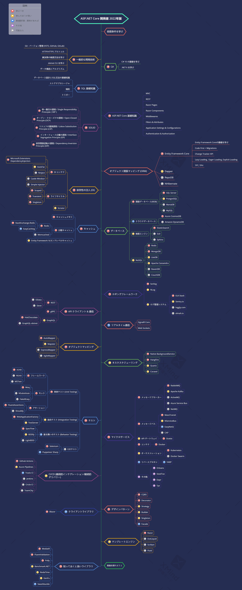

# ASP.NET Core 開発者ロードマップ

- [英語 ReadMe](ReadMe.md)
- [中国語繁体字 ReadMe](ReadMe.zh-Hant.md)
- [中国語簡体字 ReadMe](ReadMe.zh-Hans.md)
- [トルコ語 ReadMe](ReadMe-tr.md)
- [日本語 ReadMe](ReadMe.ja.md)

> 2022年に [ASP.NET Core](https://docs.microsoft.com/aspnet/core) の開発者になるためのロードマップ：

ASP.NET Coreの開発者になるために、どのような道をたどり、どのようなライブラリを習得すればよいかを示した表を以下に掲載します。このチャートは、「ASP.NET Core開発者として次に何を学ぶべきか？」と私に尋ねる人へのヒントとして作りました。

## 注意事項

> このロードマップの目的は、風景についてのアイデアを提供することです。このロードマップは、次に何を学ぶべきか迷ったときに、流行りのものを選ぶように勧めるのではなく、あなたを導いてくれるでしょう。あるツールが他のツールよりも適している理由を理解し、流行が必ずしもその仕事に最適であるとは限らないことを覚えておいてください。

## スターをください! :star:

もし、このプロジェクトが気に入ったり、解決策を学ぶため、または始めるために使用している場合は、スターを付けてください。ありがとうございます！

## ロードマップ

## リソース

1. 前提を学ぶ

   - [C#](https://www.pluralsight.com/paths/csharp)
   - [.NET 6](https://devblogs.microsoft.com/dotnet/announcing-net-6)
   - [Entity Framework](https://www.pluralsight.com/search?q=entity%20framework%20core)
   - [Dapper](https://github.com/StackExchange/Dapper)
   - [NHibernate](https://github.com/nhibernate/nhibernate-core)
   - [ASP.NET Core](https://www.pluralsight.com/search?q=asp.net%20core)
   - SQL 基礎知識

2. 一般的な開発技術

   - Gitを学び、GitHubでリポジトリを作って、あなたのコードを他の人とシェアする
   - HTTP(S) プロトコル、リクエストメソッド (GET, POST, PUT, PATCH, DELETE, OPTIONS) を知る
   - Googleや [Power Searching with Google](http://www.powersearchingwithgoogle.com) を使うことを恐れるなかれ
   - [dotnet CLI](https://docs.microsoft.com/dotnet/core/tools) を学ぶ
   - アルゴリズムやデータ構造に関する本を読む

3. ASP.NET Core 基礎知識

   - [MVC](https://docs.microsoft.com/en-us/aspnet/core/mvc/overview?view=aspnetcore-6.0)
   - [REST](https://docs.microsoft.com/en-us/aspnet/core/tutorials/first-web-api?view=aspnetcore-6.0&tabs=visual-studio)
   - [Razor Pages](https://docs.microsoft.com/en-us/aspnet/core/razor-pages/?view=aspnetcore-6.0&tabs=visual-studio)
   - [Razor Components](https://docs.microsoft.com/en-us/aspnet/core/blazor/components/?view=aspnetcore-6.0)
   - [Middlewares](https://docs.microsoft.com/en-us/aspnet/core/fundamentals/middleware/?view=aspnetcore-6.0)
   - [Filters & Attributes](https://docs.microsoft.com/en-us/aspnet/core/mvc/controllers/filters?view=aspnetcore-6.0)
   - [Application Settings & Configurations](https://docs.microsoft.com/en-us/aspnet/core/fundamentals/configuration/?view=aspnetcore-6.0)
   - [Authentication](https://docs.microsoft.com/en-us/aspnet/core/security/authentication/?view=aspnetcore-6.0)
   - [Authorization](https://docs.microsoft.com/en-us/aspnet/core/security/authorization/introduction?view=aspnetcore-6.0)
   - [IdentityServer](https://identityserver4.readthedocs.io/en/latest)
   - [Auth0](https://auth0.com/docs)
   - [OIDC](https://openid.net/connect)

4. SOLID

    - [単一責任の原則 / Single Responsibility Principle (SRP)](https://www.dotnetcurry.com/software-gardening/1148/solid-single-responsibility-principle)
    - [オープン・クローズドの原則 / Open-Closed Principle (OCP)](https://www.dotnetcurry.com/software-gardening/1176/solid-open-closed-principle)
    - [リスコフの置換原則 / Liskov Substitution Principle (LSP)](https://www.dotnetcurry.com/software-gardening/1235/liskov-substitution-principle-lsp-solid-patterns)
    - [インターフェース分離の原則 / Interface Segregation Principle (ISP)](https://www.dotnetcurry.com/software-gardening/1257/interface-segregation-principle-isp-solid-principle)
    - [依存関係逆転の原則 / Dependency Inversion Principle (DIP)](https://www.dotnetcurry.com/software-gardening/1284/dependency-injection-solid-principles)

5. 依存性の注入 (DI)

   1. DI コンテナ
      - [Microsoft.Extensions.DependencyInjection](https://docs.microsoft.com/aspnet/core/fundamentals/dependency-injection)
      - [AutoFac](https://autofaccn.readthedocs.io/en/latest/integration/aspnetcore.html)
      - [Ninject](http://www.ninject.org)
      - [Castle Windsor](https://github.com/castleproject/Windsor)
      
        - [Simple Injector](https://github.com/simpleinjector/SimpleInjector)
   2. [ライフサイクル](https://docs.microsoft.com/aspnet/core/fundamentals/dependency-injection#service-lifetimes)
   3. [Scrutor](https://github.com/khellang/Scrutor)

6. データベース

   1. 関係データベース(RDB)
      1. [SQL Server](https://www.microsoft.com/sql-server/sql-server-2019)
      2. [PostgreSQL](https://www.postgresql.org)
      3. [MariaDB](https://mariadb.org)
      4. [MySQL](https://www.mysql.com)
   2. クラウドデータベース
      - [CosmosDB](https://docs.microsoft.com/azure/cosmos-db)
      - [DynamoDB](https://aws.amazon.com/dynamodb)
   3. 検索エンジン
      - [ElasticSearch](https://www.elastic.co)
      - [Solr](http://lucene.apache.org/solr)
      - [Sphinx](http://sphinxsearch.com)
   4. NoSQL
      - [Redis](https://redis.io)
      - [MongoDB](https://docs.microsoft.com/aspnet/core/tutorials/first-mongo-app)
      - [Apache Cassandra](http://cassandra.apache.org)
      - [LiteDB](https://github.com/mbdavid/LiteDB)
      - [RavenDB](https://github.com/ravendb/ravendb)
      - [CouchDB](http://couchdb.apache.org)

7. キャッシュ

   1. [キャッシュメモリ](https://docs.microsoft.com/aspnet/core/performance/caching/memory)
   2. [分散キャッシュ](https://docs.microsoft.com/aspnet/core/performance/caching/distributed)
      1. [Redis](https://redis.io/)
         1. [StackExchange.Redis](https://stackexchange.github.io/StackExchange.Redis)
         2. [EasyCaching](https://github.com/dotnetcore/EasyCaching)
      2. [Memcached](https://memcached.org)
   3. Entity Framework セカンドレベルキャッシュ
      1. [EFCoreSecondLevelCacheInterceptor](https://github.com/VahidN/EFCoreSecondLevelCacheInterceptor)
      2. [EntityFrameworkCore.Cacheable](https://github.com/SteffenMangold/EntityFrameworkCore.Cacheable)

8. ロギング

   1. ロギングフレームワーク
      - [Serilog](https://github.com/serilog/serilog)
      - [NLog](https://github.com/NLog/NLog)
   2. ログ管理システム
      - [ELK Stack](https://www.elastic.co/what-is/elk-stack)
      - [Sentry.io](http://sentry.io)
      - [Loggly.com](https://loggly.com)
      - [Elmah.io](http://elmah.io)
   
9. API クライアント & 通信

    1. REST
       - [OData](https://devblogs.microsoft.com/odata/experimenting-with-odata-in-asp-net-core-3-1)
       - [Sieve](https://github.com/Biarity/Sieve)
    2. [gRPC](https://docs.microsoft.com/en-us/aspnet/core/grpc)
    3. GraphQL
       - [HotChocolate](https://github.com/ChilliCream/hotchocolate)
       - [GraphQL-dotnet](https://github.com/graphql-dotnet/graphql-dotnet)

10. リアルタイム通信

   - [SignalR](https://docs.microsoft.com/aspnet/core/signalr)
   - [WebSockets](https://docs.microsoft.com/en-us/aspnet/core/fundamentals/websockets)

11. オブジェクトマッピング

   - [AutoMapper](https://github.com/AutoMapper/AutoMapper)
   - [Mapster](https://github.com/MapsterMapper/Mapster)
   - [ExpressMapper](http://expressmapper.org/)
   - [AgileMapper](https://github.com/agileobjects/AgileMapper)

12. タスクスケジューリング

    - [Background Service](https://docs.microsoft.com/en-us/aspnet/core/fundamentals/host/hosted-services)
    - [HangFire](https://github.com/HangfireIO/Hangfire)
    - [Quartz](https://github.com/quartznet/quartznet)
    - [Coravel](https://github.com/jamesmh/coravel)    
    
13. テスト

    1. 単体テスト (Unit Testing)
       1. フレームワーク
          - [xUnit](https://docs.microsoft.com/dotnet/core/testing/unit-testing-with-dotnet-test)
          - [NUnit](https://docs.microsoft.com/dotnet/core/testing/unit-testing-with-nunit)
          - [MSTest](https://docs.microsoft.com/dotnet/core/testing/unit-testing-with-mstest)
       2. モック
          - [Moq](https://github.com/moq/moq4)
          - [NSubstitute](https://github.com/nsubstitute/NSubstitute)
          - [FakeItEasy](https://github.com/FakeItEasy/FakeItEasy)
       3. アサーション
          - [FluentAssertion](https://github.com/fluentassertions/fluentassertions)
          - [Shouldly](https://github.com/shouldly/shouldly)
    2. 結合テスト (Integration Testing)
       - [WebApplicationFactory](https://docs.microsoft.com/aspnet/core/test/integration-tests)
       - [TestServer](https://koukia.ca/integration-testing-in-asp-net-core-2-0-51d14ede3968)
    3. 振る舞いのテスト (Behavior Testing)
       - [SpecFlow](https://github.com/techtalk/SpecFlow/tree/DotNetCore)
       - [BDDfy](https://github.com/TestStack/TestStack.BDDfy)
       - [LightBDD](https://github.com/LightBDD/LightBDD)
    4. E2E テスト
       - [Selenium](https://www.hanselman.com/blog/real-browser-integration-testing-with-selenium-standalone-chrome-and-aspnet-core-21)
       - [Puppeteer-Sharp](https://github.com/kblok/puppeteer-sharp)

14. マイクロサービス

    1. メッセージブローカー
       - [RabbitMQ](https://www.rabbitmq.com/tutorials/tutorial-one-dotnet.html)
       - [Apache Kafka](https://github.com/confluentinc/confluent-kafka-dotnet)
       - [ActiveMQ](https://github.com/apache/activemq)
       - [Azure Service Bus](https://docs.microsoft.com/azure/service-bus-messaging/service-bus-messaging-overview)
       - [NetMQ](https://github.com/zeromq/netmq)
    2. メッセージバス
       - [MassTransit](https://github.com/MassTransit/MassTransit)
       - [NServiceBus](https://github.com/Particular/NServiceBus)
       - [EasyNetQ](https://github.com/EasyNetQ/EasyNetQ)
       - [CAP](https://github.com/dotnetcore/CAP)
    3. API ゲートウェイ
       - [Ocelot](https://github.com/ThreeMammals/Ocelot)
    4. コンテナ
       - [Docker](https://www.docker.com)
    5. オーケストレーション
       - [Kubernetes](https://kubernetes.io)
       - [Docker Swarm](https://docs.docker.com/engine/swarm)
    6. リバースプロキシ
       - [YARP](https://github.com/microsoft/reverse-proxy)
    7. その他
       - [Orleans](https://github.com/dotnet/orleans)
       - [Steeltoe](https://steeltoe.io)
       - [Dapr](https://github.com/dapr/dapr)
       - [Tye](https://github.com/dotnet/tye)

15. CI/CD (継続的インテグレーション/継続的デリバリー) 
    - [Github Actions](https://github.com/features/actions)
    - [Azure Pipelines](https://azure.microsoft.com/en-us/services/devops/pipelines)
    - [Travis CI](https://travis-ci.org)
    - [Jenkins](https://www.jenkins.io)
    - [Circle CI](https://circleci.com)
    - [TeamCity](https://www.jetbrains.com/teamcity)

16. デザインパターン

    - [CQRS](https://docs.microsoft.com/azure/architecture/patterns/cqrs)
    - [Decorator](https://www.dofactory.com/net/decorator-design-pattern)
    - [Strategy](https://www.dofactory.com/net/strategy-design-pattern)
    - [Builder](https://www.dofactory.com/net/builder-design-pattern)
    - [Singleton](https://www.dofactory.com/net/singleton-design-pattern)
    - [Facade](https://www.dofactory.com/net/facade-design-pattern)

17. クライアントライブラリ
    - [Blazor](https://dotnet.microsoft.com/apps/aspnet/web-apps/blazor)

18. テンプレートエンジン

   - [Razor](https://docs.microsoft.com/aspnet/core/mvc/views/razor)
   - [DotLiquid](https://github.com/dotliquid/dotliquid)
   - [Scriban](https://github.com/lunet-io/scriban)
   - [Fluid](https://github.com/sebastienros/fluid)

19. 知っておくと良いこと

    - [MediatR](https://github.com/jbogard/MediatR)
    - [Fluent Validation](https://github.com/JeremySkinner/FluentValidation)
    - [Polly](https://github.com/App-vNext/Polly)    
    - [Benchmark.NET](https://github.com/dotnet/BenchmarkDotNet)
    - [NodaTime](https://github.com/nodatime/nodatime)
    - [GenFu](https://github.com/MisterJames/GenFu)
    - [Swashbuckle](https://github.com/domaindrivendev/Swashbuckle.AspNetCore)

## まとめ

もし、このロードマップが改善の余地があると思うのであれば、是非、PRを作成して、更新やissueを提出してください。また、このロードマップを改善し続けますので、このリポジトリにスターを付けて再訪問してください。

参考 : [React Developer RoadMap](https://github.com/adam-golab/react-developer-roadmap)

## コントリビューション

ロードマップは[xMind](https://www.xmind.net/)を使って構築されています。プロジェクトファイルは `aspnetcore-developer-roadmap.xmind` ファイルにあります (日本語の場合は`aspnetcore-developer-roadmap.ja.xmind` )。これを修正するには、[ここ](https://www.xmind.net/download/) から xMind Zen をダウンロードして開き、**Open File** をクリックして、プロジェクトと一緒に `xmind` ファイルを選択します。ロードマップが開かれます。それを更新し、xMind からエクスポートされた画像を readme にアップロードして更新し、PR を作成します。

- 改善点をまとめたプルリクエストを開く
- issueでアイデアを議論する
- 情報を広める

## ライセンス

