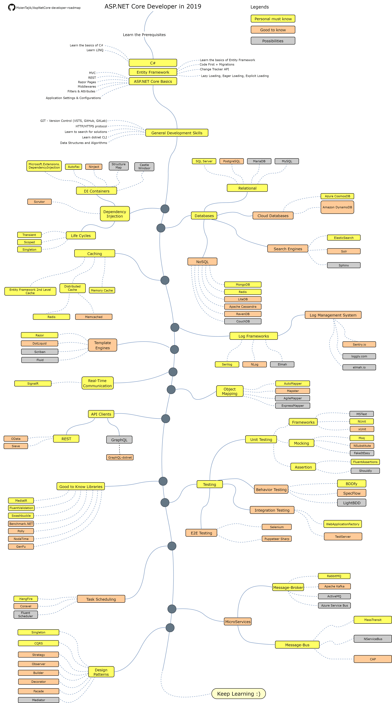

# ASP.NET Core Developer Roadmap

- [Read-me in Traditional Chinese](ReadMe.zh-Hant.md)
- [Read-me in Simplified Chinese](ReadMe.zh-Hans.md)
- [Read-me in Turkish](ReadMe-tr.md)
- [Read-me in Japanese](ReadMe.ja.md)

> Roadmap to becoming an [ASP.NET Core](https://docs.microsoft.com/aspnet/core) developer in 2023:

Below you can find a chart demonstrating the paths that you can take and the libraries that you would want to learn to become an ASP.NET Core developer. I made this chart as a tip for everyone who asks me, "What should I learn next as an ASP.NET Core developer?"

## Disclaimer

> The purpose of this roadmap is to give you an idea about the landscape. The road map will guide you if you are confused about what to learn next, rather than encouraging you to pick what is hip and trendy. You should grow some understanding of why one tool would be better suited for some cases than the other and remember hip and trendy does not always mean best suited for the job.

## Give a Star! :star:

If you like or are using this project to learn or start your solution, please give it a star. Thanks!

## Roadmap

## Resources

1. General Development Skills
   - Learn [Git](https://git-scm.com/doc), create a few repositories on [GitHub](https://docs.github.com/en/get-started/quickstart), share your code with other people
   - Know [HTTP(S) protocol](https://developer.mozilla.org/en-US/docs/Web/HTTP/Overview), request methods ([GET](https://developer.mozilla.org/en-US/docs/Web/HTTP/Methods/GET), [POST](https://developer.mozilla.org/en-US/docs/Web/HTTP/Methods/POST), [PUT](https://developer.mozilla.org/en-US/docs/Web/HTTP/Methods/PUT), [PATCH](https://developer.mozilla.org/en-US/docs/Web/HTTP/Methods/PATCH), [DELETE](https://developer.mozilla.org/en-US/docs/Web/HTTP/Methods/DELETE), [OPTIONS](https://developer.mozilla.org/en-US/docs/Web/HTTP/Methods/OPTIONS), etc.)
   - What is [TLS](https://www.cloudflare.com/learning/ssl/transport-layer-security-tls/)?
   - What is [SSL](https://www.cloudflare.com/learning/ssl/what-is-ssl/)?
   - Don't be afraid of using Google, [Power Searching with Google](http://www.powersearchingwithgoogle.com)
   - Start using [ChatGPT](https://chat.openai.com/chat)
   - [Read a few books about algorithms and data structures](https://www.interviewbit.com/blog/data-structures-and-algorithms-books)

2. C#
   - [C#](https://www.pluralsight.com/paths/c-10)
   - [.NET 7](https://devblogs.microsoft.com/dotnet/announcing-dotnet-7)
   - Learn [dotnet CLI](https://docs.microsoft.com/dotnet/core/tools)

3. SQL Fundamentals
   - [Pluralsight Learning Path: Querying Data with T-SQL from SQL Server](https://www.pluralsight.com/paths/querying-data-with-t-sql-from-sql-server)

4. ASP.NET Core Basics
   - [MVC](https://docs.microsoft.com/en-us/aspnet/core/mvc/overview)
   - [REST](https://docs.microsoft.com/en-us/aspnet/core/tutorials/first-web-api)
   - [Application Settings & Configurations](https://docs.microsoft.com/en-us/aspnet/core/fundamentals/configuration)
   - [Middlewares](https://docs.microsoft.com/en-us/aspnet/core/fundamentals/middleware)
   - [Filters & Attributes](https://docs.microsoft.com/en-us/aspnet/core/mvc/controllers/filters)
   - [Authentication](https://docs.microsoft.com/en-us/aspnet/core/security/authentication)
   - [Authorization](https://docs.microsoft.com/en-us/aspnet/core/security/authorization/introduction)
   - [IdentityServer](https://identityserver4.readthedocs.io/en/latest)
   - [OpenIddict](https://github.com/openiddict/openiddict-core)
   - [Auth0](https://auth0.com/docs)
   - [OIDC](https://openid.net/connect)
   - [Razor Pages](https://docs.microsoft.com/en-us/aspnet/core/razor-pages)
   - [Razor Components](https://docs.microsoft.com/en-us/aspnet/core/blazor/components)
   - Tutorials
      - [Pluralsight Learning Path: ASP.NET Core 6](https://www.pluralsight.com/paths/aspnet-core-6)
      - [Pluralsight Learning Path: ASP.NET Core 6 Web API](https://www.pluralsight.com/paths/aspnet-core-6-web-api)

5. SOLID
    - [Single Responsibility Principle (SRP)](https://www.dotnetcurry.com/software-gardening/1148/solid-single-responsibility-principle)
    - [Open-Closed Principle (OCP)](https://www.dotnetcurry.com/software-gardening/1176/solid-open-closed-principle)
    - [Liskov Substitution Principle (LSP)](https://www.dotnetcurry.com/software-gardening/1235/liskov-substitution-principle-lsp-solid-patterns)
    - [Interface Segregation Principle (ISP)](https://www.dotnetcurry.com/software-gardening/1257/interface-segregation-principle-isp-solid-principle)
    - [Dependency Inversion Principle (DIP)](https://www.dotnetcurry.com/software-gardening/1284/dependency-injection-solid-principles)

6. ORM
    - [Entity Framework Core](https://learn.microsoft.com/en-us/ef/core)
       - Tutorials
          - [Pluralsight Learning Path: EF Core 6](https://www.pluralsight.com/paths/ef-core-6)
    - [Dapper](https://github.com/StackExchange/Dapper)
    - [RepoDB](https://github.com/mikependon/RepoDB)

7. Dependency Injection
    1. DI Containers
       - [Microsoft.Extensions.DependencyInjection](https://docs.microsoft.com/aspnet/core/fundamentals/dependency-injection)
       - [AutoFac](https://autofaccn.readthedocs.io/en/latest/integration/aspnetcore.html)
       - [Ninject](http://www.ninject.org)
       - [Castle Windsor](https://github.com/castleproject/Windsor)
	   - [Simple Injector](https://github.com/simpleinjector/SimpleInjector)
    2. [Life Cycles](https://docs.microsoft.com/aspnet/core/fundamentals/dependency-injection#service-lifetimes)
    3. [Scrutor](https://github.com/khellang/Scrutor)

8. Databases
    1. Relational
       - [SQL Server](https://www.microsoft.com/sql-server/sql-server-2019)
       - [PostgreSQL](https://www.postgresql.org)
       - [MariaDB](https://mariadb.org)
       - [MySQL](https://www.mysql.com)
    2. Search Engines
       - [ElasticSearch](https://www.elastic.co)
       - [Solr](http://lucene.apache.org/solr)
       - [Sphinx](http://sphinxsearch.com)
    3. NoSQL
        - On-Premises
          - [Redis](https://redis.io)
          - [MongoDB](https://docs.microsoft.com/aspnet/core/tutorials/first-mongo-app)
          - [Apache Cassandra](http://cassandra.apache.org)
          - [LiteDB](https://github.com/mbdavid/LiteDB)
          - [RavenDB](https://github.com/ravendb/ravendb)
          - [CouchDB](http://couchdb.apache.org)
       - Cloud
          - [CosmosDB](https://docs.microsoft.com/azure/cosmos-db)
          - [DynamoDB](https://aws.amazon.com/dynamodb)

9. Caching
    - [Memory Cache](https://docs.microsoft.com/aspnet/core/performance/caching/memory)
    - [Distributed Cache](https://docs.microsoft.com/aspnet/core/performance/caching/distributed)
       1. [Redis](https://redis.io/)
          1. [StackExchange.Redis](https://stackexchange.github.io/StackExchange.Redis)
          2. [EasyCaching](https://github.com/dotnetcore/EasyCaching)
       2. [Memcached](https://memcached.org)
    - Application-Level
       - [Response Caching](https://learn.microsoft.com/en-us/aspnet/core/performance/caching/response)
       - [Output Caching](https://learn.microsoft.com/en-us/aspnet/core/performance/caching/output?source=recommendations)
       - [Entity Framework 2nd Level Cache](https://github.com/VahidN/EFCoreSecondLevelCacheInterceptor)

10. Log Frameworks
    - [Serilog](https://github.com/serilog/serilog)
    - [NLog](https://github.com/NLog/NLog)
      
11. API Clients & Communications
    1. REST
       - [Sieve](https://github.com/Biarity/Sieve)
       - [OData](https://learn.microsoft.com/en-us/odata/webapi/first-odata-api) 
       - [REPR Pattern](https://ardalis.com/mvc-controllers-are-dinosaurs-embrace-api-endpoints/)
            - [Minimal APIs](https://learn.microsoft.com/en-us/aspnet/core/fundamentals/minimal-apis/overview)
            - [Fast Endpoints](https://github.com/FastEndpoints/FastEndpoints)
            - [Ardalis.Endpoints](https://github.com/ardalis/ApiEndpoints)
    2. [gRPC](https://docs.microsoft.com/en-us/aspnet/core/grpc)
    3. GraphQL
        - [HotChocolate](https://github.com/ChilliCream/hotchocolate)
        - [GraphQL-dotnet](https://github.com/graphql-dotnet/graphql-dotnet)

12. Real-Time Communication
    - [SignalR](https://docs.microsoft.com/aspnet/core/signalr)
    - [WebSockets](https://docs.microsoft.com/en-us/aspnet/core/fundamentals/websockets)
   
13. Object Mapping
    - [AutoMapper](https://github.com/AutoMapper/AutoMapper)
    - [Mapster](https://github.com/MapsterMapper/Mapster)
    - [ExpressMapper](http://expressmapper.org/)
    - [AgileMapper](https://github.com/agileobjects/AgileMapper)
   
14. Background Task Scheduler
    - [Native BackgroundService](https://docs.microsoft.com/en-us/aspnet/core/fundamentals/host/hosted-services)
    - [HangFire](https://github.com/HangfireIO/Hangfire)
    - [Quartz](https://github.com/quartznet/quartznet)
    - [Coravel](https://github.com/jamesmh/coravel)    
    
15. Testing
    1. Unit Testing
       - Frameworks
          - [xUnit](https://docs.microsoft.com/dotnet/core/testing/unit-testing-with-dotnet-test)
          - [NUnit](https://docs.microsoft.com/dotnet/core/testing/unit-testing-with-nunit)
          - [MSTest](https://docs.microsoft.com/dotnet/core/testing/unit-testing-with-mstest)
       - Mocking
          - [Moq](https://github.com/moq/moq4)
          - [NSubstitute](https://github.com/nsubstitute/NSubstitute)
          - [FakeItEasy](https://github.com/FakeItEasy/FakeItEasy)
       - Assertion
          - [FluentAssertion](https://github.com/fluentassertions/fluentassertions)
          - [Shouldly](https://github.com/shouldly/shouldly)
       - Fake Data Generators
          - [Bogus](https://github.com/bchavez/Bogus)
          - [AutoFixture](https://github.com/AutoFixture/AutoFixture)
          - [GenFu](https://github.com/MisterJames/GenFu)
    2. Integration Testing
       - [WebApplicationFactory](https://docs.microsoft.com/aspnet/core/test/integration-tests)
       - [TestServer](https://koukia.ca/integration-testing-in-asp-net-core-2-0-51d14ede3968)
    3. Snapshot Testing
       - [Verify](https://github.com/VerifyTests/Verify)
    4. Behavior Testing
       - [SpecFlow](https://github.com/techtalk/SpecFlow/tree/DotNetCore)
       - [BDDfy](https://github.com/TestStack/TestStack.BDDfy)
       - [LightBDD](https://github.com/LightBDD/LightBDD)
    5. E2E Testing
       - [Selenium](https://www.hanselman.com/blog/real-browser-integration-testing-with-selenium-standalone-chrome-and-aspnet-core-21)
       - [Puppeteer-Sharp](https://github.com/kblok/puppeteer-sharp)
    6. Performance Testing
       - [K6](https://github.com/grafana/k6)
       - [JMeter](https://github.com/apache/jmeter)
       - [Crank](https://github.com/dotnet/crank)
       - [Bombardier](https://github.com/codesenberg/bombardier)

16. Microservices
    1. Message-Brokers
       - [RabbitMQ](https://www.rabbitmq.com/tutorials/tutorial-one-dotnet.html)
       - [Apache Kafka](https://github.com/confluentinc/confluent-kafka-dotnet)
       - [ActiveMQ](https://github.com/apache/activemq)
       - [Azure Service Bus](https://docs.microsoft.com/azure/service-bus-messaging/service-bus-messaging-overview)
       - [NetMQ](https://github.com/zeromq/netmq)
    2. Message-Bus
       - [MassTransit](https://github.com/MassTransit/MassTransit)
       - [NServiceBus](https://github.com/Particular/NServiceBus)
       - [EasyNetQ](https://github.com/EasyNetQ/EasyNetQ)
       - [CAP](https://github.com/dotnetcore/CAP)
    3. API Gateway
       - [Ocelot](https://github.com/ThreeMammals/Ocelot)
       - [YARP](https://github.com/microsoft/reverse-proxy)
    4. Containerization
       - [Docker](https://www.docker.com)
    5. Orcherstration
       - [Kubernetes](https://kubernetes.io)
         - [Rancher](https://github.com/rancher/rancher)
         - [Kubectl](https://kubernetes.io/docs/reference/kubectl)
         - [K9s](https://github.com/derailed/k9s)
       - [Docker Swarm](https://docs.docker.com/engine/swarm)
    6. Other
       - [Orleans](https://github.com/dotnet/orleans)
       - [Proto.Actor](https://github.com/asynkron/protoactor-dotnet)
       - [Steeltoe](https://steeltoe.io)
       - [Dapr](https://github.com/dapr/dapr)
       - [Tye](https://github.com/dotnet/tye)

17. Continuous Integration & Continuous Delivery
    - [GitHub Actions](https://github.com/features/actions)
    - [Gitlab CI](https://docs.gitlab.com/ee/ci)
    - [Azure Pipelines](https://azure.microsoft.com/en-us/services/devops/pipelines)
    - [Travis CI](https://travis-ci.org)
    - [Jenkins](https://www.jenkins.io)
    - [Circle CI](https://circleci.com)
    - [TeamCity](https://www.jetbrains.com/teamcity)

18. Design Patterns
    - Categories
      - [Creational](https://docs.microsoft.com/azure/architecture/patterns/cqrs)
      - [Structural](https://www.dofactory.com/net/decorator-design-pattern)
      - [Behavioral](https://www.dofactory.com/net/strategy-design-pattern)
    - Tutorials
      - [Pluralsight Learning Path: Design Patterns in C#](https://www.pluralsight.com/paths/design-patterns-in-c)

19. Monitoring/Logging/Tracing/Alerting
    - Monitoring
       - On-Premises
          - [Prometheus](https://github.com/prometheus/prometheus)
          - [Grafana](https://github.com/grafana/grafana)
       - Cloud
          - [Datadog](https://www.datadoghq.com)
    - Logging
       - On-Premises
          - [ELK Stack](https://www.elastic.co/what-is/elk-stack)
          - [Seq](https://datalust.co/seq)
       - Cloud
          - [Datadog](https://docs.datadoghq.com/logs)
    - Tracing
       - On-Premises
          - [OpenTelemetry](https://github.com/open-telemetry/opentelemetry-dotnet)
             - [Jaeger](https://github.com/jaegertracing/jaeger)
             - [Zipkin](https://github.com/openzipkin/zipkin)
       - Cloud
          - [Datadog](https://docs.datadoghq.com/tracing)
    - Alerting
       - On-Premises
          - [Zabbix](https://www.zabbix.com)
          - [Alertmanager](https://github.com/prometheus/alertmanager)
       - Cloud
          - [Datadog](https://docs.datadoghq.com/monitors)

20. Client-Side .NET
    - Template Engines
       - [Razor](https://docs.microsoft.com/aspnet/core/mvc/views/razor)
       - [DotLiquid](https://github.com/dotliquid/dotliquid)
       - [Scriban](https://github.com/lunet-io/scriban)
       - [Fluid](https://github.com/sebastienros/fluid)
    - Frameworks
       - [Blazor](https://dotnet.microsoft.com/apps/aspnet/web-apps/blazor)
       - [.NET MAUI](https://github.com/dotnet/maui)

21. Good to Know
    - [MediatR](https://github.com/jbogard/MediatR)
    - [Fluent Validation](https://github.com/JeremySkinner/FluentValidation)
    - [Polly](https://github.com/App-vNext/Polly)
    - [Benchmark.NET](https://github.com/dotnet/BenchmarkDotNet)
    - [NodaTime](https://github.com/nodatime/nodatime)
    - [Swashbuckle](https://github.com/domaindrivendev/Swashbuckle.AspNetCore)
    - [Nuke](https://github.com/nuke-build/nuke)
    - [EF Core Bulk Extensions](https://github.com/borisdj/EFCore.BulkExtensions)

## Wrap Up

If you think the roadmap can be improved, please do open a PR with any updates and submit any issues. Also, I will continue to improve this, so you might want to star this repository to revisit.

Idea from : [React Developer RoadMap](https://github.com/adam-golab/react-developer-roadmap)

## Contribution

Want to contribute? We encourage community feedback and contributions. Please follow our [contributing guidelines](https://github.com/MoienTajik/AspNetCore-Developer-Roadmap/blob/master/CONTRIBUTING.md).

## Credits

### Backers

Thank you to all our backers! 🙏 [[Become a backer](https://opencollective.com/AspNetCore-Developer-Roadmap#backer)]

### Sponsors

Support this project by becoming a sponsor. Your logo will show up here with a link to your website. [[Become a sponsor](https://github.com/sponsors/MoienTajik)]

## License

