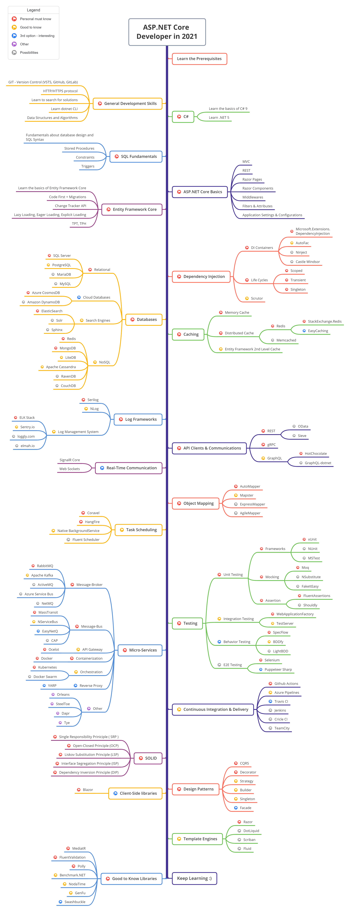

# ASP.NET Core Developer Roadmap

- [Dark Version](https://raw.githubusercontent.com/MoienTajik/AspNetCore-Developer-Roadmap/master/aspnetcore-developer-roadmap.png)
- [Read-me in Simplified Chinese](ReadMe.zh-Hans.md)
- [Read-me in Traditional Chinese](ReadMe.zh-Hant.md)

> Roadmap to becoming an [ASP.NET Core](https://docs.microsoft.com/aspnet/core) developer in 2021:

Below you can find a chart demonstrating the paths that you can take and the libraries that you would want to learn to become an ASP.NET Core developer. I made this chart as a tip for everyone who asks me, "What should I learn next as an ASP.NET Core developer?"

## Disclaimer

> The purpose of this roadmap is to give you an idea about the landscape. The road map will guide you if you are confused about what to learn next, rather than encouraging you to pick what is hip and trendy. You should grow some understanding of why one tool would be better suited for some cases than the other and remember hip and trendy does not always mean best suited for the job

## Give a Star! :star:

If you like or are using this project to learn or start your solution, please give it a star. Thanks!

## Roadmap

## Resources

1. Learn the prerequisites

   - [C#](https://www.pluralsight.com/paths/csharp)
   - [.NET 5](https://devblogs.microsoft.com/dotnet/introducing-net-5)
   - [Entity Framework](https://www.pluralsight.com/search?q=entity%20framework%20core)
   - [Dapper](https://github.com/StackExchange/Dapper)
   - [NHibernate](https://github.com/nhibernate/nhibernate-core)
   - [ASP.NET Core](https://www.pluralsight.com/search?q=asp.net%20core)
   - SQL Fundamentals

2. General Development Skills

   - Learn GIT, create a few repositories on GitHub, share your code with other people
   - Know HTTP(S) protocol, request methods (GET, POST, PUT, PATCH, DELETE, OPTIONS)
   - Don't be afraid of using Google, [Power Searching with Google](http://www.powersearchingwithgoogle.com)
   - Learn [dotnet CLI](https://docs.microsoft.com/dotnet/core/tools)
   - Read a few books about algorithms and data structures

3. SOLID

    - [Single Responsibility Principle (SRP)](https://www.dotnetcurry.com/software-gardening/1148/solid-single-responsibility-principle)
    - [Open-Closed Principle (OCP)](https://www.dotnetcurry.com/software-gardening/1176/solid-open-closed-principle)
    - [Liskov Substitution Principle (LSP)](https://www.dotnetcurry.com/software-gardening/1235/liskov-substitution-principle-lsp-solid-patterns)
    - [Interface Segregation Principle (ISP)](https://www.dotnetcurry.com/software-gardening/1257/interface-segregation-principle-isp-solid-principle)
    - [Dependency Inversion Principle (DIP)](https://www.dotnetcurry.com/software-gardening/1284/dependency-injection-solid-principles)

4. Dependency Injection

   1. DI Containers
      - [Microsoft.Extensions.DependencyInjection](https://docs.microsoft.com/aspnet/core/fundamentals/dependency-injection)
      - [AutoFac](https://autofaccn.readthedocs.io/en/latest/integration/aspnetcore.html)
      - [Ninject](http://www.ninject.org)
      - [Castle Windsor](https://github.com/castleproject/Windsor)
	  - [Simple Injector](https://github.com/simpleinjector/SimpleInjector)
   2. [Life Cycles](https://docs.microsoft.com/aspnet/core/fundamentals/dependency-injection#service-lifetimes)
   3. [Scrutor](https://github.com/khellang/Scrutor)

5. Databases

   1. Relational
      1. [SQL Server](https://www.microsoft.com/sql-server/sql-server-2019)
      2. [PostgreSQL](https://www.postgresql.org)
      3. [MariaDB](https://mariadb.org)
      4. [MySQL](https://www.mysql.com)
   2. Cloud Databases
      - [CosmosDB](https://docs.microsoft.com/azure/cosmos-db)
      - [DynamoDB](https://aws.amazon.com/dynamodb)
   3. Search Engines
      - [ElasticSearch](https://www.elastic.co)
      - [Solr](http://lucene.apache.org/solr)
      - [Sphinx](http://sphinxsearch.com)
   4. NoSQL
      - [Redis](https://redis.io)
      - [MongoDB](https://docs.microsoft.com/aspnet/core/tutorials/first-mongo-app)
      - [Apache Cassandra](http://cassandra.apache.org)
      - [LiteDB](https://github.com/mbdavid/LiteDB)
      - [RavenDB](https://github.com/ravendb/ravendb)
      - [CouchDB](http://couchdb.apache.org)

6. Caching

   1. [Memory Cache](https://docs.microsoft.com/aspnet/core/performance/caching/memory)
   2. [Distributed Cache](https://docs.microsoft.com/aspnet/core/performance/caching/distributed)
      1. [Redis](https://redis.io/)
         1. [StackExchange.Redis](https://stackexchange.github.io/StackExchange.Redis)
         2. [EasyCaching](https://github.com/dotnetcore/EasyCaching)
      2. [Memcached](https://memcached.org)
   3. Entity Framework 2nd Level Cache
      1. [EFSecondLevelCache.Core](https://github.com/VahidN/EFSecondLevelCache.Core)
      2. [EntityFrameworkCore.Cacheable](https://github.com/SteffenMangold/EntityFrameworkCore.Cacheable)

7. Logging

   1. Log Frameworks
      - [Serilog](https://github.com/serilog/serilog)
      - [NLog](https://github.com/NLog/NLog)
   2. Log Management System
      - [ELK Stack](https://www.elastic.co/what-is/elk-stack)
      - [Sentry.io](http://sentry.io)
      - [Loggly.com](https://loggly.com)
      - [Elmah.io](http://elmah.io)
      
8. API Clients & Communications

    1. REST
       - [OData](https://devblogs.microsoft.com/odata/experimenting-with-odata-in-asp-net-core-3-1)
       - [Sieve](https://github.com/Biarity/Sieve)
    2. [gRPC](https://docs.microsoft.com/en-us/aspnet/core/grpc)
    3. GraphQL
       - [HotChocolate](https://github.com/ChilliCream/hotchocolate)
       - [GraphQL-dotnet](https://github.com/graphql-dotnet/graphql-dotnet)

9. Real-Time Communication

   - [SignalR](https://docs.microsoft.com/aspnet/core/signalr)
   - [WebSockets](https://docs.microsoft.com/en-us/aspnet/core/fundamentals/websockets)
   
10. Object Mapping

   - [AutoMapper](https://github.com/AutoMapper/AutoMapper)
   - [Mapster](https://github.com/MapsterMapper/Mapster)
   - [ExpressMapper](http://expressmapper.org/)
   - [AgileMapper](https://github.com/agileobjects/AgileMapper)
   
11. Task Scheduling

    - [Coravel](https://github.com/jamesmh/coravel)
    - [HangFire](https://github.com/HangfireIO/Hangfire)
    - [Background Service](https://docs.microsoft.com/en-us/aspnet/core/fundamentals/host/hosted-services)
    - [Fluent Scheduler](https://github.com/fluentscheduler/FluentScheduler)
    
12. Testing

    1. Unit Testing
       1. Frameworks
          - [xUnit](https://docs.microsoft.com/dotnet/core/testing/unit-testing-with-dotnet-test)
          - [NUnit](https://docs.microsoft.com/dotnet/core/testing/unit-testing-with-nunit)
          - [MSTest](https://docs.microsoft.com/dotnet/core/testing/unit-testing-with-mstest)
       2. Mocking
          - [Moq](https://github.com/moq/moq4)
          - [NSubstitute](https://github.com/nsubstitute/NSubstitute)
          - [FakeItEasy](https://github.com/FakeItEasy/FakeItEasy)
       3. Assertion
          - [FluentAssertion](https://github.com/fluentassertions/fluentassertions)
          - [Shouldly](https://github.com/shouldly/shouldly)
    2. Integration Testing
       - [WebApplicationFactory](https://docs.microsoft.com/aspnet/core/test/integration-tests)
       - [TestServer](https://koukia.ca/integration-testing-in-asp-net-core-2-0-51d14ede3968)
    3. Behavior Testing
       - [SpecFlow](https://github.com/techtalk/SpecFlow/tree/DotNetCore)
       - [BDDfy](https://github.com/TestStack/TestStack.BDDfy)
       - [LightBDD](https://github.com/LightBDD/LightBDD)
    4. E2E Testing
       - [Selenium](https://www.hanselman.com/blog/real-browser-integration-testing-with-selenium-standalone-chrome-and-aspnet-core-21)
       - [Puppeteer-Sharp](https://github.com/kblok/puppeteer-sharp)

13. Micro-Services

    1. Message-Broker
       - [RabbitMQ](https://www.rabbitmq.com/tutorials/tutorial-one-dotnet.html)
       - [Apache Kafka](https://github.com/confluentinc/confluent-kafka-dotnet)
       - [ActiveMQ](https://github.com/apache/activemq)
       - [Azure Service Bus](https://docs.microsoft.com/azure/service-bus-messaging/service-bus-messaging-overview)
       - [NetMQ](https://github.com/zeromq/netmq)
    2. Message-Bus
       - [MassTransit](https://github.com/MassTransit/MassTransit)
       - [NServiceBus](https://github.com/Particular/NServiceBus)
       - [EasyNetQ](https://github.com/EasyNetQ/EasyNetQ)
       - [CAP](https://github.com/dotnetcore/CAP)
    3. API Gateway
       - [Ocelot](https://github.com/ThreeMammals/Ocelot)
    4. Containerization
       - [Docker](https://www.docker.com)
    5. Orcherstration
       - [Kubernetes](https://kubernetes.io)
       - [Docker Swarm](https://docs.docker.com/engine/swarm)
    6. Reverse Proxy
       - [YARP](https://github.com/microsoft/reverse-proxy)
    7. Other
       - [Orleans](https://github.com/dotnet/orleans)
       - [Steeltoe](https://steeltoe.io)
       - [Dapr](https://github.com/dapr/dapr)
       - [Tye](https://github.com/dotnet/tye)

14. Continuous Integration & Delivery
    - [Gihub Actions](https://github.com/features/actions)
    - [Azure Pipelines](https://azure.microsoft.com/en-us/services/devops/pipelines)
    - [Travis CI](https://travis-ci.org)
    - [Jenkins](https://www.jenkins.io)
    - [Circle CI](https://circleci.com)
    - [TeamCity](https://www.jetbrains.com/teamcity)

15. Design-Patterns

    - [CQRS](https://docs.microsoft.com/azure/architecture/patterns/cqrs)
    - [Decorator](https://www.dofactory.com/net/decorator-design-pattern)
    - [Strategy](https://www.dofactory.com/net/strategy-design-pattern)
    - [Builder](https://www.dofactory.com/net/builder-design-pattern)
    - [Singleton](https://www.dofactory.com/net/singleton-design-pattern)
    - [Facade](https://www.dofactory.com/net/facade-design-pattern)

16. Client-Side Libraries
    - [Blazor](https://dotnet.microsoft.com/apps/aspnet/web-apps/blazor)

17. Template Engines

   - [Razor](https://docs.microsoft.com/aspnet/core/mvc/views/razor)
   - [DotLiquid](https://github.com/dotliquid/dotliquid)
   - [Scriban](https://github.com/lunet-io/scriban)
   - [Fluid](https://github.com/sebastienros/fluid)

18. Good to Know

    - [MediatR](https://github.com/jbogard/MediatR)
    - [Fluent Validation](https://github.com/JeremySkinner/FluentValidation)
    - [Polly](https://github.com/App-vNext/Polly)    
    - [Benchmark.NET](https://github.com/dotnet/BenchmarkDotNet)
    - [NodaTime](https://github.com/nodatime/nodatime)
    - [GenFu](https://github.com/MisterJames/GenFu)
    - [Swashbuckle](https://github.com/domaindrivendev/Swashbuckle.AspNetCore)

## Wrap Up

If you think the roadmap can be improved, please do open a PR with any updates and submit any issues. Also, I will continue to improve this, so you might want to star this repository to revisit.

Idea from : [React Developer RoadMap](https://github.com/adam-golab/react-developer-roadmap)

## Contribution

Want to contribute? We encourage community feedback and contributions. Please follow our [contributing guidelines](https://github.com/MoienTajik/AspNetCore-Developer-Roadmap/blob/master/CONTRIBUTING.md).

## Credits

### Backers

Thank you to all our backers! 🙏 [[Become a backer](https://opencollective.com/AspNetCore-Developer-Roadmap#backer)]

### Sponsors

Support this project by becoming a sponsor. Your logo will show up here with a link to your website. [[Become a sponsor](https://opencollective.com/AspNetCore-Developer-Roadmap#sponsor)]

## License

