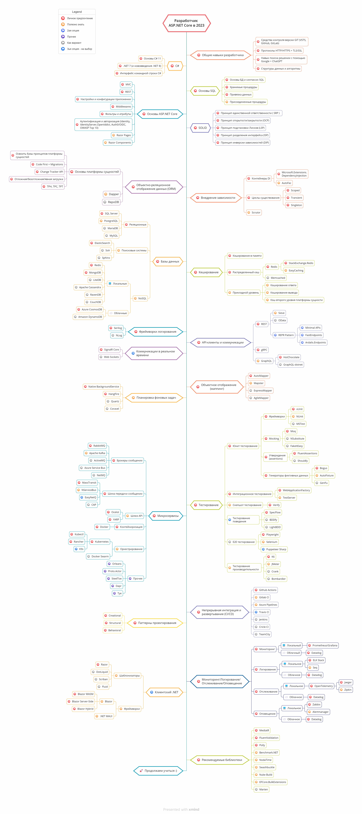

# Дорожная карта разработчика ASP.NET Core 

- [Read-me на Английском](ReadMe.md)
- [Read-me на Традиционном китайском](ReadMe.zh-Hant.md)
- [Read-me на Упрощенном китайском](ReadMe.zh-Hans.md)
- [Read-me на Турецком](ReadMe-tr.md)
- [Read-me на Японском](ReadMe.ja.md)

> Дорожная карта разработчика [ASP.NET Core](https://docs.microsoft.com/aspnet/core) в 2023:
На данной карте представлен список технологий и библиотек, которые вам стоит изучить, чтобы стать разработчиком ASP.NET Core. Я создал эту карту в качестве простого руководства для всех, кто спрашивает меня: "Что я должен изучить дальше, чтобы стать разработчиком ASP.NET Core?"

## Дисклеймер

> Цель этой дорожной карты - помочь вам понять общую картину. Она поможет вам определить, что изучать дальше, а не просто следовать модным технологиям. Важно разобраться, когда и какие технологии лучше использовать в конкретных ситуациях и помнить, что модные и трендовые технологии не всегда подходят для всех задач.

## Поставьте звездочку! :star:

Если вам понравилась эта карта или вы собираетесь использовать ее или просто разобрались с ее применением, пожалуйста, поставьте звездочку. Мы благодарим вас!

## Дорожная карта

## Материалы

1. Общие навыки разработчика
   - Освойте [Git](https://git-scm.com/doc), создайте пару репозиториев на [GitHub](https://docs.github.com/en/get-started/quickstart), покажите свой код другим.
   - Освойте [протокол HTTP(S)](https://developer.mozilla.org/ru/docs/Web/HTTP/Overview), методы запросов ([GET](https://developer.mozilla.org/ru/docs/Web/HTTP/Methods/GET), [POST](https://developer.mozilla.org/ru/docs/Web/HTTP/Methods/POST), [PUT](https://developer.mozilla.org/ru/docs/Web/HTTP/Methods/PUT), [PATCH](https://developer.mozilla.org/ru/docs/Web/HTTP/Methods/PATCH), [DELETE](https://developer.mozilla.org/ru/docs/Web/HTTP/Methods/DELETE), [OPTIONS](https://developer.mozilla.org/ru/docs/Web/HTTP/Methods/OPTIONS), etc.)
   - Что такое [TLS](https://www.cloudflare.com/learning/ssl/transport-layer-security-tls/)?
   - Что такое [SSL](https://www.cloudflare.com/learning/ssl/what-is-ssl/)?
   - Не бойтесь использовать Google, [прокачайте навык гугления](http://www.powersearchingwithgoogle.com)
   - Начните использовать [ChatGPT](https://chat.openai.com/chat)
   - [Прочтите несколько книг о структурах данных и алгоритмах](https://www.interviewbit.com/blog/data-structures-and-algorithms-books)

2. C#
   - [C#](https://www.pluralsight.com/paths/c-10)
   - [.NET 7](https://devblogs.microsoft.com/dotnet/announcing-dotnet-7)
   - Интерфейс командной строки [dotnet CLI](https://docs.microsoft.com/dotnet/core/tools)

3. Основы SQL
   - [Pluralsight Learning Path: Querying Data with T-SQL from SQL Server](https://www.pluralsight.com/paths/querying-data-with-t-sql-from-sql-server)

4. Основы ASP.NET Core
   - [MVC](https://docs.microsoft.com/ru-ru/aspnet/core/mvc/overview)
   - [REST](https://docs.microsoft.com/ru-ru/aspnet/core/tutorials/first-web-api)
   - [Настройки и конфигурации приложении](https://docs.microsoft.com/ru-ru/aspnet/core/fundamentals/configuration)
   - [Middlewares](https://docs.microsoft.com/ru-ru/aspnet/core/fundamentals/middleware)
   - [Фильтры и атрибуты](https://docs.microsoft.com/ru-ru/aspnet/core/mvc/controllers/filters)
   - [Аутентификация](https://docs.microsoft.com/ru-ru/aspnet/core/security/authentication)
   - [Авторизация](https://docs.microsoft.com/ru-ru/aspnet/core/security/authorization/introduction)
   - [IdentityServer](https://identityserver4.readthedocs.io/en/latest)
   - [OpenIddict](https://github.com/openiddict/openiddict-core)
   - [Auth0](https://auth0.com/docs)
   - [OIDC](https://openid.net/connect)
   - [Razor Pages](https://docs.microsoft.com/ru-ru/aspnet/core/razor-pages)
   - [Razor Components](https://docs.microsoft.com/ru-ru/aspnet/core/blazor/components)
   - Обучающие материалы
      - [Pluralsight Learning Path: ASP.NET Core 6](https://www.pluralsight.com/paths/aspnet-core-6)
      - [Pluralsight Learning Path: ASP.NET Core 6 Web API](https://www.pluralsight.com/paths/aspnet-core-6-web-api)

5. SOLID
    - [Принцип единственной ответственности (SRP)](https://www.dotnetcurry.com/software-gardening/1148/solid-single-responsibility-principle)
    - [Принцип открытости/закрытости (OCP)](https://www.dotnetcurry.com/software-gardening/1176/solid-open-closed-principle)
    - [Принцип подстановки Лисков (LSP)](https://www.dotnetcurry.com/software-gardening/1235/liskov-substitution-principle-lsp-solid-patterns)
    - [Принцип разделения интерфейса (ISP)](https://www.dotnetcurry.com/software-gardening/1257/interface-segregation-principle-isp-solid-principle)
    - [Принцип инверсии зависимостей (DIP)](https://www.dotnetcurry.com/software-gardening/1284/dependency-injection-solid-principles)

6. Объектно-реляционное отображение данных (ORM)
    - [Основы платформы сущностей(EF Core)](https://learn.microsoft.com/ru-ru/ef/core)
       - Обучающие материалы
          - [Pluralsight Learning Path: EF Core 6](https://www.pluralsight.com/paths/ef-core-6)
    - [Dapper](https://github.com/StackExchange/Dapper)
    - [RepoDB](https://github.com/mikependon/RepoDB)

7. Внедрение зависимости
    1. Контейнеры DI
       - [Microsoft.Extensions.DependencyInjection](https://docs.microsoft.com/aspnet/core/fundamentals/dependency-injection)
       - [AutoFac](https://autofaccn.readthedocs.io/en/latest/integration/aspnetcore.html)
       - [Ninject](http://www.ninject.org)
       - [Castle Windsor](https://github.com/castleproject/Windsor)
	   - [Simple Injector](https://github.com/simpleinjector/SimpleInjector)
    2. [Циклы существования](https://docs.microsoft.com/aspnet/core/fundamentals/dependency-injection#service-lifetimes)
    3. [Scrutor](https://github.com/khellang/Scrutor)

8. Базы данных
    1. Реляционные
       - [SQL Server](https://www.microsoft.com/sql-server/sql-server-2019)
       - [PostgreSQL](https://www.postgresql.org)
       - [MariaDB](https://mariadb.org)
       - [MySQL](https://www.mysql.com)
    2. Поисковые системы
       - [ElasticSearch](https://www.elastic.co)
       - [Solr](http://lucene.apache.org/solr)
       - [Sphinx](http://sphinxsearch.com)
    3. NoSQL
        - Локальный
          - [Redis](https://redis.io)
          - [MongoDB](https://docs.microsoft.com/aspnet/core/tutorials/first-mongo-app)
          - [Apache Cassandra](http://cassandra.apache.org)
          - [LiteDB](https://github.com/mbdavid/LiteDB)
          - [RavenDB](https://github.com/ravendb/ravendb)
          - [CouchDB](http://couchdb.apache.org)
       - Облачный
          - [CosmosDB](https://docs.microsoft.com/azure/cosmos-db)
          - [DynamoDB](https://aws.amazon.com/dynamodb)

9. Кэширование
    - [Кэширование в памяти](https://docs.microsoft.com/aspnet/core/performance/caching/memory)
    - [Распределенный кэш](https://docs.microsoft.com/aspnet/core/performance/caching/distributed)
       1. [Redis](https://redis.io/)
          1. [StackExchange.Redis](https://stackexchange.github.io/StackExchange.Redis)
          2. [EasyCaching](https://github.com/dotnetcore/EasyCaching)
       2. [Memcached](https://memcached.org)
    - Прикладной уровень
       - [Кэширование ответа](https://learn.microsoft.com/ru-ru/aspnet/core/performance/caching/response)
       - [Кэширование вывода](https://learn.microsoft.com/ru-ru/aspnet/core/performance/caching/output?source=recommendations)
       - [Кэш второго уровня платформы сущности(EF)](https://github.com/VahidN/EFCoreSecondLevelCacheInterceptor)

10. Фреймворки логирования
    - [Serilog](https://github.com/serilog/serilog)
    - [NLog](https://github.com/NLog/NLog)
      
11. API-клиенты и коммуникации
    1. REST
       - [Sieve](https://github.com/Biarity/Sieve)
       - [OData](https://learn.microsoft.com/ru-ru/odata/webapi/first-odata-api) 
       - [REPR Pattern](https://ardalis.com/mvc-controllers-are-dinosaurs-embrace-api-endpoints/)
            - [Minimal APIs](https://learn.microsoft.com/ru-ru/aspnet/core/fundamentals/minimal-apis/overview)
            - [Fast Endpoints](https://github.com/FastEndpoints/FastEndpoints)
            - [Ardalis.Endpoints](https://github.com/ardalis/ApiEndpoints)
    2. [gRPC](https://docs.microsoft.com/ru-ru/aspnet/core/grpc)
    3. GraphQL
        - [HotChocolate](https://github.com/ChilliCream/hotchocolate)
        - [GraphQL-dotnet](https://github.com/graphql-dotnet/graphql-dotnet)

12. Коммуникации в реальном времени
    - [SignalR](https://docs.microsoft.com/aspnet/core/signalr)
    - [WebSockets](https://docs.microsoft.com/ru-ru/aspnet/core/fundamentals/websockets)
   
13. Объектное отображение (маппинг)
    - [AutoMapper](https://github.com/AutoMapper/AutoMapper)
    - [Mapster](https://github.com/MapsterMapper/Mapster)
    - [ExpressMapper](http://expressmapper.org/)
    - [AgileMapper](https://github.com/agileobjects/AgileMapper)
   
14. Планировка фоновых задач
    - [Native BackgroundService](https://docs.microsoft.com/ru-ru/aspnet/core/fundamentals/host/hosted-services)
    - [HangFire](https://github.com/HangfireIO/Hangfire)
    - [Quartz](https://github.com/quartznet/quartznet)
    - [Coravel](https://github.com/jamesmh/coravel)    
    
15. Тестирование
    1. Юнит тестирование
       - Фреймворки
          - [xUnit](https://docs.microsoft.com/dotnet/core/testing/unit-testing-with-dotnet-test)
          - [NUnit](https://docs.microsoft.com/dotnet/core/testing/unit-testing-with-nunit)
          - [MSTest](https://docs.microsoft.com/dotnet/core/testing/unit-testing-with-mstest)
       - Mocking
          - [Moq](https://github.com/moq/moq4)
          - [NSubstitute](https://github.com/nsubstitute/NSubstitute)
          - [FakeItEasy](https://github.com/FakeItEasy/FakeItEasy)
       - Утверждения (assertions)
          - [FluentAssertion](https://github.com/fluentassertions/fluentassertions)
          - [Shouldly](https://github.com/shouldly/shouldly)
       - Генераторы фиктивных данных
          - [Bogus](https://github.com/bchavez/Bogus)
          - [AutoFixture](https://github.com/AutoFixture/AutoFixture)
          - [GenFu](https://github.com/MisterJames/GenFu)
    2. Интеграционное тестирование
       - [WebApplicationFactory](https://docs.microsoft.com/aspnet/core/test/integration-tests)
       - [TestServer](https://koukia.ca/integration-testing-in-asp-net-core-2-0-51d14ede3968)
    3. Снэпшот тестирование
       - [Verify](https://github.com/VerifyTests/Verify)
    4. Тестирование поведения
       - [SpecFlow](https://github.com/techtalk/SpecFlow/tree/DotNetCore)
       - [BDDfy](https://github.com/TestStack/TestStack.BDDfy)
       - [LightBDD](https://github.com/LightBDD/LightBDD)
    5. E2E тестирование
       - [Selenium](https://www.hanselman.com/blog/real-browser-integration-testing-with-selenium-standalone-chrome-and-aspnet-core-21)
       - [Puppeteer-Sharp](https://github.com/kblok/puppeteer-sharp)
    6. Тестирование производительности
       - [K6](https://github.com/grafana/k6)
       - [JMeter](https://github.com/apache/jmeter)
       - [Crank](https://github.com/dotnet/crank)
       - [Bombardier](https://github.com/codesenberg/bombardier)

16. Микросервисы
    1. Брокеры сообщении
       - [RabbitMQ](https://www.rabbitmq.com/tutorials/tutorial-one-dotnet.html)
       - [Apache Kafka](https://github.com/confluentinc/confluent-kafka-dotnet)
       - [ActiveMQ](https://github.com/apache/activemq)
       - [Azure Service Bus](https://docs.microsoft.com/azure/service-bus-messaging/service-bus-messaging-overview)
       - [NetMQ](https://github.com/zeromq/netmq)
    2. Шина передачи сообщении
       - [MassTransit](https://github.com/MassTransit/MassTransit)
       - [NServiceBus](https://github.com/Particular/NServiceBus)
       - [EasyNetQ](https://github.com/EasyNetQ/EasyNetQ)
       - [CAP](https://github.com/dotnetcore/CAP)
    3. Шлюз API
       - [Ocelot](https://github.com/ThreeMammals/Ocelot)
       - [YARP](https://github.com/microsoft/reverse-proxy)
    4. Контейнеризация
       - [Docker](https://www.docker.com)
    5. Оркестровка
       - [Kubernetes](https://kubernetes.io)
         - [Rancher](https://github.com/rancher/rancher)
         - [Kubectl](https://kubernetes.io/docs/reference/kubectl)
         - [K9s](https://github.com/derailed/k9s)
       - [Docker Swarm](https://docs.docker.com/engine/swarm)
    6. Прочее
       - [Orleans](https://github.com/dotnet/orleans)
       - [Proto.Actor](https://github.com/asynkron/protoactor-dotnet)
       - [Steeltoe](https://steeltoe.io)
       - [Dapr](https://github.com/dapr/dapr)
       - [Tye](https://github.com/dotnet/tye)

17. Непрерывная интеграция и развертывание(CI/CD)
    - [GitHub Actions](https://github.com/features/actions)
    - [Gitlab CI](https://docs.gitlab.com/ee/ci)
    - [Azure Pipelines](https://azure.microsoft.com/ru-ru/services/devops/pipelines)
    - [Travis CI](https://travis-ci.org)
    - [Jenkins](https://www.jenkins.io)
    - [Circle CI](https://circleci.com)
    - [TeamCity](https://www.jetbrains.com/teamcity)

18. Паттерны проектирования
    - Категории
      - [Creational](https://docs.microsoft.com/azure/architecture/patterns/cqrs)
      - [Structural](https://www.dofactory.com/net/decorator-design-pattern)
      - [Behavioral](https://www.dofactory.com/net/strategy-design-pattern)
    - Обучающие материалы
      - [Pluralsight Learning Path: Design Patterns in C#](https://www.pluralsight.com/paths/design-patterns-in-c)

19. Мониторинг/Логирование/Отслеживание/Оповещение
    - Мониторинг
       - Локальный
          - [Prometheus](https://github.com/prometheus/prometheus)
          - [Grafana](https://github.com/grafana/grafana)
       - Облачный
          - [Datadog](https://www.datadoghq.com)
    - Логирование
       - Локальное
          - [ELK Stack](https://www.elastic.co/what-is/elk-stack)
          - [Seq](https://datalust.co/seq)
       - Облачное
          - [Datadog](https://docs.datadoghq.com/logs)
    - Отслеживание
       - Локальное
          - [OpenTelemetry](https://github.com/open-telemetry/opentelemetry-dotnet)
             - [Jaeger](https://github.com/jaegertracing/jaeger)
             - [Zipkin](https://github.com/openzipkin/zipkin)
       - Облачное
          - [Datadog](https://docs.datadoghq.com/tracing)
    - Оповещение
       - Локальное
          - [Zabbix](https://www.zabbix.com)
          - [Alertmanager](https://github.com/prometheus/alertmanager)
       - Облачное
          - [Datadog](https://docs.datadoghq.com/monitors)

20. Клиентский.NET
    - Шаблонизаторы
       - [Razor](https://docs.microsoft.com/aspnet/core/mvc/views/razor)
       - [DotLiquid](https://github.com/dotliquid/dotliquid)
       - [Scriban](https://github.com/lunet-io/scriban)
       - [Fluid](https://github.com/sebastienros/fluid)
    - Фреймворки
       - [Blazor](https://dotnet.microsoft.com/apps/aspnet/web-apps/blazor)
       - [.NET MAUI](https://github.com/dotnet/maui)

21. Будет полезным
    - [MediatR](https://github.com/jbogard/MediatR)
    - [Fluent Validation](https://github.com/JeremySkinner/FluentValidation)
    - [Polly](https://github.com/App-vNext/Polly)
    - [Benchmark.NET](https://github.com/dotnet/BenchmarkDotNet)
    - [NodaTime](https://github.com/nodatime/nodatime)
    - [Swashbuckle](https://github.com/domaindrivendev/Swashbuckle.AspNetCore)
    - [Nuke](https://github.com/nuke-build/nuke)
    - [EF Core Bulk Extensions](https://github.com/borisdj/EFCore.BulkExtensions)

## Заключение

Если у вас есть предложения по улучшению этой карты, пожалуйста, отправьте запрос на изменение (PR) с вашими обновлениями или задайте вопросы в разделе Issues. Кроме того, я буду продолжать обновлять эту карту, поэтому не забудьте поставить звезду, чтобы не пропустить новые обновления.

Идя взята из : [React Developer RoadMap](https://github.com/adam-golab/react-developer-roadmap)

## Участие

Хотите поучаствовать? Мы ценим фидбек и участие сообщества. Просьба придерживатся [гайдлайну по участию](https://github.com/MoienTajik/AspNetCore-Developer-Roadmap/blob/master/CONTRIBUTING.md).

## Упоминания

### Поддержка

Благодарим всех кто нас поддерживает! 🙏 [[Поддержать](https://opencollective.com/AspNetCore-Developer-Roadmap#backer)]

### Спонсоры

Поддержите этот проект став спонсором. Ваше лого будет отображено здесь со ссылкой на ваш сайт. [[Стать спонсором](https://github.com/sponsors/MoienTajik)]

## Лицензия

