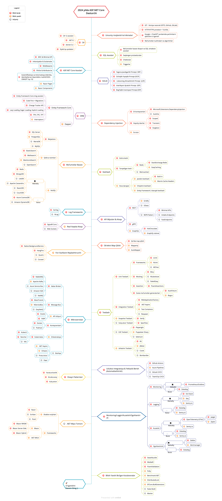

# ASP.NET Core Dasturchi Yo'l Xaritasi

- [Read-me An'anaviy Xitoy Tilida](ReadMe.zh-Hant.md)
- [Read-me Soddalashtirilgan Xitoy Tilida](ReadMe.zh-Hans.md)
- [Read-me Turk Tilida](ReadMe-tr.md)
- [Read-me Yapon Tilida](ReadMe.ja.md)
- [Read-me Rus Tilida](ReadMe.ru.md)

> 2024 yilda [ASP.NET Core](https://docs.microsoft.com/aspnet/core) dasturchisi bo'lish uchun yo'l xaritasi:

Quyida siz ASP.NET Core dasturchisi bo'lishni o'rganishingiz mumkin bo'lgan yo'llar va kutubxonalarni ko'rsatadigan jadvalni topishingiz mumkin. Men ushbu jadvalni mendan “ASP.NET Core dasturchisi sifatida keyin nimani o‘rganishim kerak?” deb so‘ragan har bir kishi uchun maslahat sifatida tuzdim.

## Disclaimer

> Ushbu yo'l xaritasining maqsadi sizga landshaft haqida tushuncha berishdir. Yo'l xaritasi sizni nimani o'rganishingiz kerakligi haqida bosh qotirsangiz, sizni zamonaviy bo'lgan narsalarni tanlashga undashdan ko'ra, sizga yo'l ko'rsatadi. Siz nima uchun bir vosita ba'zi holatlar uchun boshqasiga qaraganda yaxshiroq mos kelishini tushunishingiz kerak va esda tutingki, zamonaviysi har doim ham ish uchun eng mos keladi degani emas.

## Yulduzchani Bosing! :star:

Agar siz ushbu loyihani o'rganish yoki yechimingizni boshlash uchun yoqtirgan bo'lsangiz yoki foydalanayotgan bo'lsangiz, unga yulduzchani bosing. Rahmat!

## Yo'l Xaritasi

## Resurslar

1. Umumiy rivojlanish ko'nikmalari
   - [Git](https://www.youtube.com/playlist?list=PLd1cTxGen2d42uGivV8rlaUY1LR2s5zHr) ni o'rganing, [GitHub](https://www.youtube.com/watch?v=BtNnhUOCYrI) da bir nechta repositoriyalarni yarating, kodingizni boshqa odamlar bilan baham ko'ring
   - [HTTP(S) protokol](https://www.youtube.com/watch?v=0mwO6QmtY5A), so'rov usullari ([GET](https://developer.mozilla.org/en-US/docs/Web/HTTP/Methods/GET), [POST](https://developer.mozilla.org/en-US/docs/Web/HTTP/Methods/POST), [PUT](https://developer.mozilla.org/en-US/docs/Web/HTTP/Methods/PUT), [PATCH](https://developer.mozilla.org/en-US/docs/Web/HTTP/Methods/PATCH), [DELETE](https://developer.mozilla.org/en-US/docs/Web/HTTP/Methods/DELETE), [OPTIONS](https://developer.mozilla.org/en-US/docs/Web/HTTP/Methods/OPTIONS), va boshqalar)
   - [TLS](https://www.youtube.com/watch?v=EIoMdjLL2yc) nima?
   - [SSL](https://www.youtube.com/watch?v=OI3JrPMd25E) nima?
   - Google'dan foydalanishdan qo'rqmang, [Google yordamida kuchli qidiruv](https://www.youtube.com/watch?v=6mkBrvLM-7g)
   - [ChatGPT](https://chat.openai.com/chat) dan foydalanishni boshlang
   - [Algoritmlar va ma'lumotlar tuzilmalari haqida o'rganing](https://www.youtube.com/playlist?list=PL_WK6W0Gn1I7rCQ28pxKwHbSO1EGzB381)

2. C#
   - [C#](https://docs.dot-net.uz/c-.net/basic/starter)
   - [.NET 8](https://docs.dot-net.uz/c-.net/dotnetga-xushkelibsiz)
   - [.NET CLI](https://docs.dot-net.uz/c-.net/.net-dasturchi/cli)
   - [StyleCop qoidalari](https://github.com/DotNetAnalyzers/StyleCopAnalyzers/blob/master/DOCUMENTATION.md)

3. SQL Asoslari
   - Darsliklar 📚
     - [MS SQL Server (Farkhod Dadajanov)](https://www.youtube.com/watch?v=zNqayVWmAbA&list=PL1538BF8E4A3E5D56)

5. ASP.NET Core asoslari
   - [MVC](https://docs.dot-net.uz/c-.net/web-development/asp.net-core-mvc/mvc-nima)
   - [Minimal APIs](youtube.com/watch?v=cBW2HBsQ5X0&t=2872s)
   - [REST](https://docs.microsoft.com/en-us/aspnet/core/tutorials/first-web-api)
   - [Ilova Sozlamalari & Konfiguratsiyalari](https://docs.microsoft.com/en-us/aspnet/core/fundamentals/configuration)
   - [Middlewares](https://www.youtube.com/watch?v=FCf8GmfuF2U)
   - [Filtrlar & Attribute-lar](https://docs.microsoft.com/en-us/aspnet/core/mvc/controllers/filters)
   - [Autentifikatsiya](https://docs.microsoft.com/en-us/aspnet/core/security/authentication)
   - [Avtorizatsiya](https://docs.microsoft.com/en-us/aspnet/core/security/authorization/introduction)
   - [IdentityServer](https://www.youtube.com/watch?v=7mzVukehoXo&t=4360s)
   - [Duende IdentityServer](https://duendesoftware.com)
   - [OpenIddict](https://github.com/openiddict/openiddict-core)
   - [Auth0](https://auth0.com/docs)
   - [OIDC](https://openid.net/connect)
   - [Razor Pages](https://docs.microsoft.com/en-us/aspnet/core/razor-pages)
   - [Razor Components](https://docs.microsoft.com/en-us/aspnet/core/blazor/components)
   - Darsliklar 📚
      - [ASP .Net Core batafsil (Farkhod Dadajanov)](https://www.youtube.com/playlist?list=PL_WK6W0Gn1I6OqYlkP_evQKq4K6xFwpu8)

6. SOLID
    - [Yagona Javobgarlik Prinsipi (SRP)](https://docs.dot-net.uz/c-.net/.net-dasturchi/clean-architecture/design-tamoyillari/solid/yagona-masuliyat-tamoyili-srp)
    - [Ochiqlik-Yopiqlik Prinsipi (OCP)](https://docs.dot-net.uz/c-.net/.net-dasturchi/clean-architecture/design-tamoyillari/solid/ochiq-yopiq-tamoyili-o-cp)
    - [Liskovning Almashtirish Prinsipi (LSP)](https://docs.dot-net.uz/c-.net/.net-dasturchi/clean-architecture/design-tamoyillari/solid/liskovning-almashtirish-tamoyili-lsp)
    - [Interfeysni Ajratish Prinsipi (ISP)](https://docs.dot-net.uz/c-.net/.net-dasturchi/clean-architecture/design-tamoyillari/solid/interfeysga-ajratish-tamoyili-isp)
    - [Bog'liqlik Inversiyasi Prinsipi (DIP)](https://docs.dot-net.uz/c-.net/.net-dasturchi/clean-architecture/design-tamoyillari/solid/qaramlik-inversiya-tamoyili-dip)

7. ORM
    - [Entity Framework Core](https://docs.dot-net.uz/c-.net/orm)
       - Darsliklar 📚
          - [Entity Framework Core bilan ishlash](https://www.youtube.com/watch?v=6XR2lV3ErNk&t=1s)
    - [ASP.NET Core da Dapper](https://www.youtube.com/watch?v=sGJmMR16lfI&t=1s)

8. Dependency Injection
    1. DI Konteynerlari
       - [Microsoft.Extensions.DependencyInjection](https://docs.microsoft.com/aspnet/core/fundamentals/dependency-injection)
       - [AutoFac](https://autofaccn.readthedocs.io/en/latest/integration/aspnetcore.html)
    2. [Scrutor](https://github.com/khellang/Scrutor)
    - Darsliklar 📚
       - [Dependency Injection haqida (Farkhod Dadajanov)](https://www.youtube.com/watch?v=S7_B2lSrNB4) 

9. Ma'lumotlar Bazasi
    1. Relyatsion
       - [SQL Server](https://docs.dot-net.uz/database/ms-sql-server)
       - [PostgreSQL](https://docs.dot-net.uz/database/postgresql)
       - [MariaDB](https://mariadb.org)
       - [MySQL](https://www.youtube.com/watch?v=9A6bqFUtUz8&list=PLcVkxa4hDY3HMSLeg6QOLftJUhLX2JJP)
    2. Qidiruv tizimlari
       - [ElasticSearch](https://www.elastic.co)
       - [Meilisearch](https://github.com/meilisearch/meilisearch)
       - [ManticoreSearch](https://github.com/manticoresoftware/manticoresearch)
       - [OpenSearch](https://github.com/opensearch-project/OpenSearch)
    3. NoSQL
        - Mahalliy
          - [Redis](https://www.youtube.com/watch?v=fCjRbWW4mzM&t=1s)
          - [MongoDB](https://www.youtube.com/watch?v=Gm0vrNrP45U&list=PL_WK6W0Gn1I7ishKsAaB8JaOVcg6NpndK)
          - [Apache Cassandra](http://cassandra.apache.org)
          - [LiteDB](https://github.com/mbdavid/LiteDB)
          - [RavenDB](https://github.com/ravendb/ravendb)
          - [CouchDB](http://couchdb.apache.org)
       - Bulut
          - [CosmosDB](https://docs.microsoft.com/azure/cosmos-db)
          - [DynamoDB](https://aws.amazon.com/dynamodb)

10. Keshlash
    - [Xotira keshi](https://www.youtube.com/watch?v=fCjRbWW4mzM&t=2s&pp=ygUXa2VzaGxhc2ggTURDIFV6YmVraXN0YW4%3D)
    - [Tarqatilgan kesh](https://www.youtube.com/watch?v=fCjRbWW4mzM&t=2s&pp=ygUXa2VzaGxhc2ggTURDIFV6YmVraXN0YW4%3D)
       1. [Redis](https://www.youtube.com/watch?v=fCjRbWW4mzM&t=2s&pp=ygUXa2VzaGxhc2ggTURDIFV6YmVraXN0YW4%3D)
          1. [StackExchange.Redis](https://stackexchange.github.io/StackExchange.Redis)
          2. [EasyCaching](https://github.com/dotnetcore/EasyCaching)
       2. [Memcached](https://memcached.org)
    - Ilova darajasi
       - Javobni keshlash
          1. [Built in](https://learn.microsoft.com/en-us/aspnet/core/performance/caching/response)
          2. [Marvin.Cache.Headers](https://github.com/KevinDockx/HttpCacheHeaders)
       - [Chiqishni keshlash](https://learn.microsoft.com/en-us/aspnet/core/performance/caching/output?source=recommendations)
       - [Entity Framework 2-darajali kesh](https://github.com/VahidN/EFCoreSecondLevelCacheInterceptor)

11. Log Frameworks
    - [Serilog](https://www.youtube.com/watch?v=RyjuC-TAxHk&t=1s&pp=ygUWU2VyaWxvZyBNREMgVXpiZWtpc3Rhbg%3D%3D)
    - [NLog](https://github.com/NLog/NLog)
      
12. API Mijozlari va Aloqalari
    1. REST
       - [Gridify](https://github.com/alirezanet/Gridify)
       - [OData](https://learn.microsoft.com/en-us/odata/webapi/first-odata-api) 
       - [REPR Pattern](https://ardalis.com/mvc-controllers-are-dinosaurs-embrace-api-endpoints/)
            - [Minimal APIs](https://learn.microsoft.com/en-us/aspnet/core/fundamentals/minimal-apis/overview)
            - [Ardalis.Endpoints](https://github.com/ardalis/ApiEndpoints)
            - [Fast Endpoints](https://github.com/FastEndpoints/FastEndpoints)
    2. [gRPC](https://docs.microsoft.com/en-us/aspnet/core/grpc)
    3. GraphQL
        - [HotChocolate](https://github.com/ChilliCream/hotchocolate)
        - [GraphQL-dotnet](https://github.com/graphql-dotnet/graphql-dotnet)
    - Darsliklar 📚
      - [From Zero to Hero: REST APIs in .NET](https://dometrain.com/course/from-zero-to-hero-rest-apis-in-asp-net-core/?affcode=1115529_alq6yoqt)
      - [From Zero to Hero: Minimal APIs in .NET with C#](https://dometrain.com/course/from-zero-to-hero-minimal-apis-in-net-with-c/?affcode=1115529_alq6yoqt)
      - [From Zero to Hero: gRPC in .NET](https://dometrain.com/course/from-zero-to-hero-grpc-in-dotnet/?affcode=1115529_alq6yoqt)

13. Real vaqtda aloqa
    - [SignalR](https://www.youtube.com/watch?v=mj_9_IYBJvY&t=1s&pp=ygUWU2lnbmFsUiBNREMgVXpiZWtpc3Rhbg%3D%3D)
    - [WebSockets](https://www.youtube.com/watch?v=6Ps7dxJ6qdo&pp=ygUZV2ViU29ja2V0cyBNREMgVXpiZWtpc3Rhbg%3D%3D)
   
14. Obyektni map qilish
    - [Qo'lda map qilish!](https://www.youtube.com/watch?v=U8gSdQN2jWI)
    - [Mapperly](https://github.com/riok/mapperly)
    - [AutoMapper](https://github.com/AutoMapper/AutoMapper)
   
15. Fondagi vazifalarni rejalashtiruvchisi
    - [Native BackgroundService](https://docs.microsoft.com/en-us/aspnet/core/fundamentals/host/hosted-services)
    - [HangFire](https://github.com/HangfireIO/Hangfire)
    - [Quartz](https://github.com/quartznet/quartznet)
    - [Coravel](https://github.com/jamesmh/coravel)    
    
16. Testlash
    1. Unit Testlash
       - Frameworks
          - [xUnit](https://www.youtube.com/watch?v=DtvNioh9eHo&t=1s&pp=ygUTdGVzdCBNREMgVXpiZWtpc3Rhbg%3D%3D)
          - [NUnit](https://docs.microsoft.com/dotnet/core/testing/unit-testing-with-nunit)
          - [MSTest](https://docs.microsoft.com/dotnet/core/testing/unit-testing-with-mstest)
       - Mocking
          - [Moq](https://github.com/moq/moq4)
          - [NSubstitute](https://github.com/nsubstitute/NSubstitute)
          - [FakeItEasy](https://github.com/FakeItEasy/FakeItEasy)
       - Assertion
          - [FluentAssertion](https://github.com/fluentassertions/fluentassertions)
       - Soxta ma'lumotlar generatorlari
          - [Bogus](https://github.com/bchavez/Bogus)
          - [AutoFixture](https://github.com/AutoFixture/AutoFixture)
    2. Integratsion Testlash
       - [WebApplicationFactory](https://docs.microsoft.com/aspnet/core/test/integration-tests)
       - [.NET Aspire](https://learn.microsoft.com/en-us/dotnet/aspire)
       - [Test Containers](https://github.com/testcontainers/testcontainers-dotnet)
       - [Respwan](https://github.com/jbogard/Respawn)
    3. Snapshot Testlash
       - [Verify](https://github.com/VerifyTests/Verify)
    4. Xulq-atvor Testing
       - [SpecFlow](https://github.com/techtalk/SpecFlow/tree/DotNetCore)
    5. E2E Testlash
       - [Selenium](https://www.hanselman.com/blog/real-browser-integration-testing-with-selenium-standalone-chrome-and-aspnet-core-21)
       - [Puppeteer-Sharp](https://github.com/kblok/puppeteer-sharp)
    6. Ishlashni Testlash
       - [K6](https://github.com/grafana/k6)
       - [JMeter](https://github.com/apache/jmeter)
       - [Crank](https://github.com/dotnet/crank)
       - [Bombardier](https://github.com/codesenberg/bombardier)
    - Darsliklar 📚
      - [From Zero to Hero: Unit testing in C#](https://dometrain.com/course/from-zero-to-hero-unit-testing-in-c/?affcode=1115529_alq6yoqt)
      - [From Zero to Hero: Integration testing in ASP.NET Core](https://dometrain.com/course/from-zero-to-hero-integration-testing-in-asp-net-core/?affcode=1115529_alq6yoqt)
      - [From Zero to Hero: Test-Driven Development in C#](https://dometrain.com/course/from-zero-to-hero-test-driven-development-tdd-csharp/?affcode=1115529_alq6yoqt)

17. Mikroservislar
    1. Xabar-Brokerlari
       - [RabbitMQ](https://www.youtube.com/watch?v=8tfAazpwqik&t=1s&pp=ygUXUmFiYml0TVEgTURDIFV6YmVraXN0YW4%3D)
       - [Apache Kafka](https://github.com/confluentinc/confluent-kafka-dotnet)
       - [Azure Service Bus](https://docs.microsoft.com/azure/service-bus-messaging)
       - [Amazon SQS](https://aws.amazon.com/sqs)
       - [NetMQ](https://github.com/zeromq/netmq)
    2. Message-Bus
       - [MassTransit](https://github.com/MassTransit/MassTransit)
       - [NServiceBus](https://github.com/Particular/NServiceBus)
       - [EasyNetQ](https://github.com/EasyNetQ/EasyNetQ)
    3. API Gateway
       - [Ocelot](https://github.com/ThreeMammals/Ocelot)
       - [YARP](https://github.com/microsoft/reverse-proxy)
    4. Konteynerlash
       - [Docker](https://www.youtube.com/watch?v=trW0gihZ78E&list=PL_WK6W0Gn1I4jcUIwAUkcLM76k08Bqi2K)
       - [Podman](https://podman.io)
    5. Orkestratsiya
       - [Kubernetes](https://kubernetes.io)
         - [Rancher](https://github.com/rancher/rancher)
         - [Kubectl](https://kubernetes.io/docs/reference/kubectl)
         - [K9s](https://github.com/derailed/k9s)
    6. Boshqa
       - [.NET Aspire](https://learn.microsoft.com/en-us/dotnet/aspire)
       - [Orleans](https://github.com/dotnet/orleans)
       - [Proto.Actor](https://github.com/asynkron/protoactor-dotnet)
       - [Dapr](https://github.com/dapr/dapr)
    - Darsliklar 📚
      - [Getting Started: Microservices Architecture](https://dometrain.com/course/getting-started-microservices-architecture/?affcode=1115529_alq6yoqt)
      - [Getting Started: Solution Architecture](https://dometrain.com/course/getting-started-solution-architecture/?affcode=1115529_alq6yoqt)
      - [From Zero to Hero: Docker for Developers](https://dometrain.com/course/from-zero-to-hero-docker/?affcode=1115529_alq6yoqt)

18. Uzluksiz integratsiya va uzluksiz yetkazib berish
    - [GitHub Actions](https://www.youtube.com/watch?v=7O4MCfJs8aY&pp=ygUdR2l0SHViIEFjdGlvbnMgTURDIFV6YmVraXN0YW4%3D)
    - [Azure Pipelines](https://azure.microsoft.com/en-us/services/devops/pipelines)
    - [GitLab CI/CD](https://docs.gitlab.com/ee/ci)
    - [TeamCity CI/CD](https://www.jetbrains.com/teamcity)

19. Dizayn patternlari
    - Kategoriyalar
      - [Yaratuvchanlik](https://refactoring.guru/design-patterns/creational-patterns)
      - [Strukturaviy](https://refactoring.guru/design-patterns/structural-patterns)
      - [Xulq-atvor](https://refactoring.guru/design-patterns/behavioral-patterns)
    - Darsliklar 📚
      - [Design Pattern (Farkhod Dadajanov)](https://www.youtube.com/watch?v=dreyroBhzL4&list=PL_WK6W0Gn1I6IM4WkC7B62mdslDdhH2fY&pp=iAQB)

20. Monitoring/Logging/Kuzatish/Ogohlantirish
    - Monitoring
       - Mahalliy
          - [Prometheus](https://github.com/prometheus/prometheus)
          - [Grafana](https://github.com/grafana/grafana)
       - Bulut
          - [Datadog](https://www.datadoghq.com)
    - Logging
       - Mahalliy
          - [ELK Stack](https://www.elastic.co/what-is/elk-stack)
          - [Seq](https://datalust.co/seq)
          - [Sentry.io](https://sentry.io/welcome/)
       - Bulut
          - [Datadog](https://docs.datadoghq.com/logs)
          - [Sentry.io](https://sentry.io/welcome/)
       - Darsliklar 📚
         - [From Zero to Hero: Logging in .NET](https://dometrain.com/course/from-zero-to-hero-logging-in-dotnet/?affcode=1115529_alq6yoqt)
    - Kuzatish
       - Mahalliy
          - [OpenTelemetry](https://github.com/open-telemetry/opentelemetry-dotnet)
             - [Jaeger](https://github.com/jaegertracing/jaeger)
             - [Zipkin](https://github.com/openzipkin/zipkin)
             - [Sentry.io](https://sentry.io/welcome/)
       - Bulut
          - [Datadog](https://docs.datadoghq.com/tracing)
          - [Sentry.io](https://sentry.io/welcome/)
    - Ogohlantirish
       - Mahalliy
          - [Zabbix](https://www.zabbix.com)
          - [Alertmanager](https://github.com/prometheus/alertmanager)
       - Bulut
          - [Datadog](https://docs.datadoghq.com/monitors)

21. .NET Mijoz tomoni
    - Shablon enjinlari
       - [Razor](https://docs.microsoft.com/aspnet/core/mvc/views/razor)
       - [Scriban](https://github.com/lunet-io/scriban)
       - [Fluid](https://github.com/sebastienros/fluid)
    - Frameworks
       - [Blazor](https://www.youtube.com/watch?v=fCD4OUM2dxA&t=1s&pp=ygUVQmxhem9yIE1EQyBVemJla2lzdGFu)
       - [.NET MAUI](https://github.com/dotnet/maui)

22. Bilish yaxshi
    - [Swashbuckle](https://github.com/domaindrivendev/Swashbuckle.AspNetCore)
    - [MediatR](https://github.com/jbogard/MediatR)
    - [Fluent Validation](https://github.com/JeremySkinner/FluentValidation)
    - [Polly](https://github.com/App-vNext/Polly)
    - [Benchmark.NET](https://github.com/dotnet/BenchmarkDotNet)
    - [Distributed Lock](https://github.com/madelson/DistributedLock)
    - [EF Core Bulk Extensions](https://github.com/borisdj/EFCore.BulkExtensions)
    - [Nuke Build](https://github.com/nuke-build/nuke)
    - [Marten](https://github.com/JasperFx/marten)

## Wrap Up

Agar yo'l xaritasini yaxshilash mumkin deb hisoblasangiz, iltimos, har qanday yangilanishlar bilan PRni oching va har qanday muammolarni yuboring. Bundan tashqari, men buni yaxshilashda davom etaman, shuning uchun siz ushbu repository-ni qayta ko'rib chiqish uchun yulduzchani bosib qo'ying.

[React Dasturcih yo'l xaritasi](https://github.com/adam-golab/react-developer-roadmap) dan g'oya olingan

## Hissa Qo'shish

Hissa qo'shishni xohlaysizmi? Biz hamjamiyatning fikr-mulohazalari va hissalarini qo'llab-quvvatlaymiz. Iltimos, [hissa qoʻshish boʻyicha koʻrsatmalarimizga](https://github.com/MoienTajik/AspNetCore-Developer-Roadmap/blob/master/CONTRIBUTING.md) amal qiling.

## Kreditlar

### Qo'llab-Quvvatlovchilar

Barcha qo'llab-quvvatlovchilarimizga rahmat! 🙏 [[Qo'llab-quvvatlovchiga aylaning](https://opencollective.com/AspNetCore-Developer-Roadmap#backer)]

### Homiylar

Homiy bo'lish orqali ushbu loyihani qo'llab-quvvatlang. Sizning logotipingiz veb-saytingizga havola bilan bu erda ko'rsatiladi. [[Homiy bo'ling](https://github.com/sponsors/MoienTajik)]

## Litsenziya

