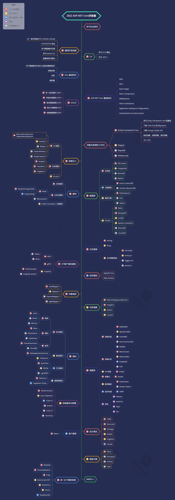

# ASP.NET Core开发者指南

- [英文 ReadMe](ReadMe.md)
- [繁體中文 ReadMe](ReadMe.zh-Hant.md)
- [简体中文 ReadMe](ReadMe.zh-Hans.md)
- [土耳其文 ReadMe](ReadMe-tr.md)
- [日文 ReadMe](ReadMe.ja.md)

> 2023年 [ASP.NET Core](https://docs.microsoft.com/zh-cn/aspnet/core/) 开发人员指南：

以下您会看到一张图，说明可以采取的学习路径以及要成为ASP.NET Core开发人员所要学习的库。我将此图作为提示，给每个问我「作为ASP.NET Core 开发人员，接下来应该学习什么？」的人。

## 免责声明

> 这份指南的目的是为了给读者心里有个大概的轮廓。如果您对接下来要学习的内容感到困惑时，这张路线指南将引导您，而不是鼓励您选择时髦和前卫的东西。您应该逐渐理解为什么一种工具比另一种工具更适合某些场景，并且记住时髦和前卫的东西并不总是意味着最适合完成工作。

## 请给一个星星! :star:

如果您喜欢或正在使用这个项目进行学习或开始您的解决方案，请给它一个星星。谢谢!

## 路线图

## 学习资源

1. 一般开发技能
   - 学习[Git](https://git-scm.com/doc)并且在[GitHub](https://docs.github.com/zh/get-started/quickstart)中创建与分享您的项目
   - 掌握[HTTP(S)协定](https://developer.mozilla.org/en-US/docs/Web/HTTP/Overview)与请求方法([GET](https://developer.mozilla.org/en-US/docs/Web/HTTP/Methods/GET)， [POST](https://developer.mozilla.org/en-US/docs/Web/HTTP/Methods/POST)， [PUT](https://developer.mozilla.org/en-US/docs/Web/HTTP/Methods/PUT)， [PATCH](https://developer.mozilla.org/en-US/docs/Web/HTTP/Methods/PATCH)， [DELETE](https://developer.mozilla.org/en-US/docs/Web/HTTP/Methods/DELETE)， [OPTIONS](https://developer.mozilla.org/en-US/docs/Web/HTTP/Methods/OPTIONS)等)
   - 什么是[TLS](https://www.cloudflare.com/zh-cn/learning/ssl/transport-layer-security-tls/)？
   - 什么是[SSL](https://www.cloudflare.com/zh-cn/learning/ssl/what-is-ssl/)？
   - 不要害怕使用[Google搜索技巧](http://www.powersearchingwithgoogle.com)
   - 开始使用[ChatGPT](https://chat.openai.com/chat)
   - [阅读一些关于算法和数据结构的书籍](https://www.interviewbit.com/blog/data-structures-and-algorithms-books)

2. C#
   - [C#](https://www.pluralsight.com/paths/c-10)
   - [.NET 7](https://devblogs.microsoft.com/dotnet/announcing-dotnet-7)
   - 学习[dotnet CLI](https://learn.microsoft.com/zh-cn/dotnet/core/tools/)

3. SQL基础知识
   - [Pluralsight学习路径：从SQL Server使用T-SQL查找数据](https://www.pluralsight.com/paths/querying-data-with-t-sql-from-sql-server)

4. ASP.NET Core基础
   - [MVC](https://docs.microsoft.com/zh-cn/aspnet/core/mvc/overview)
   - [REST](https://docs.microsoft.com/zh-cn/aspnet/core/tutorials/first-web-api)
   - [Application Settings & Configurations](https://docs.microsoft.com/zh-cn/aspnet/core/fundamentals/configuration)
   - [Middlewares](https://docs.microsoft.com/zh-cn/aspnet/core/fundamentals/middleware/)
   - [Filters & Attributes](https://docs.microsoft.com/zh-cn/aspnet/core/mvc/controllers/filters)
   - [Authentication](https://docs.microsoft.com/zh-cn/aspnet/core/security/authentication/)
   - [Authorization](https://docs.microsoft.com/zh-cn/aspnet/core/security/authorization/introduction)
   - [IdentityServer](https://identityserver4.readthedocs.io/en/latest)
   - [OpenIddict](https://github.com/openiddict/openiddict-core)
   - [Auth0](https://auth0.com/docs)
   - [OIDC](https://openid.net/connect)
   - [Razor Pages](https://docs.microsoft.com/zh-cn/aspnet/core/razor-pages/)
   - [Razor Components](https://docs.microsoft.com/zh-cn/aspnet/core/blazor/components/)
   - 教学课程
      - [Pluralsight学习路径：ASP.NET Core 6](https://www.pluralsight.com/paths/aspnet-core-6)
      - [Pluralsight学习路径：ASP.NET Core 6 Web API](https://www.pluralsight.com/paths/aspnet-core-6-web-api)

5. SOLID
    - [单一职责原则(SRP)](https://www.dotnetcurry.com/software-gardening/1148/solid-single-responsibility-principle)
    - [开放封闭原则(OCP)](https://www.dotnetcurry.com/software-gardening/1176/solid-open-closed-principle)
    - [里氏替换原则(LSP)](https://www.dotnetcurry.com/software-gardening/1235/liskov-substitution-principle-lsp-solid-patterns)
    - [接口隔离原则(ISP)](https://www.dotnetcurry.com/software-gardening/1257/interface-segregation-principle-isp-solid-principle)
    - [依赖反转原则(DIP)](https://www.dotnetcurry.com/software-gardening/1284/dependency-injection-solid-principles)

6. 对象关系映射
    - [Entity Framework Core](https://learn.microsoft.com/zh-cn/ef/core/)
       - 教学课程
          - [Pluralsight学习路径：EF Core 6](https://www.pluralsight.com/paths/ef-core-6)
    - [Dapper](https://github.com/StackExchange/Dapper)
    - [RepoDB](https://github.com/mikependon/RepoDB)

7. 依赖注入
   1. 注入容器
      - [Microsoft.Extensions.DependencyInjection](https://docs.microsoft.com/zh-cn/aspnet/core/fundamentals/dependency-injection)
      - [AutoFac](https://autofaccn.readthedocs.io/en/latest/integration/aspnetcore.html)
      - [Ninject](http://www.ninject.org)
      - [Castle Windsor](https://github.com/castleproject/Windsor)
	  - [Simple Injector](https://github.com/simpleinjector/SimpleInjector)
   2. [生命周期](https://docs.microsoft.com/zh-cn/aspnet/core/fundamentals/dependency-injection#service-lifetimes)
   3. [Scrutor](https://github.com/khellang/Scrutor)

8. 数据库
   1. 关系型
      - [SQL Server](https://www.microsoft.com/zh-cn/sql-server/sql-server-2022)
      - [PostgreSQL](https://www.postgresql.org)
      - [MariaDB](https://mariadb.org)
      - [MySQL](https://www.mysql.com)
   3. 搜索引擎
      - [ElasticSearch](https://www.elastic.co)
      - [Solr](http://lucene.apache.org/solr)
      - [Sphinx](http://sphinxsearch.com)
   4. NoSQL
        - 本地
          - [Redis](https://redis.io)
          - [MongoDB](https://docs.microsoft.com/zh-cn/aspnet/core/tutorials/first-mongo-app)
          - [Apache Cassandra](http://cassandra.apache.org)
          - [LiteDB](https://github.com/mbdavid/LiteDB)
          - [RavenDB](https://github.com/ravendb/ravendb)
          - [CouchDB](http://couchdb.apache.org)
        - 云
          - [CosmosDB](https://docs.microsoft.com/azure/cosmos-db)
          - [DynamoDB](https://aws.amazon.com/dynamodb)   

9. 缓存
    - [内存缓存](https://docs.microsoft.com/zh-cn/aspnet/core/performance/caching/memory)
    - [分布式缓存](https://docs.microsoft.com/zh-cn/aspnet/core/performance/caching/distributed)
       1. [Redis](https://redis.io/)
          1. [StackExchange.Redis](https://stackexchange.github.io/StackExchange.Redis)
          2. [EasyCaching](https://github.com/dotnetcore/EasyCaching)
       2. [Memcached](https://memcached.org)
    - 应用程序层级
       - [回应缓存](https://learn.microsoft.com/zh-cn/aspnet/core/performance/caching/response)
       - [输出缓存](https://learn.microsoft.com/zh-cn/aspnet/core/performance/caching/output?source=recommendations)
       - [Entity Framework第二层缓存](https://github.com/VahidN/EFCoreSecondLevelCacheInterceptor)

10. 日志框架
    - [Serilog](https://github.com/serilog/serilog)
    - [NLog](https://github.com/NLog/NLog)

11. API用户端及通信
    1. REST
       - [Sieve](https://github.com/Biarity/Sieve)
       - [OData](https://learn.microsoft.com/zh-cn/odata/webapi/first-odata-api) 
       - [REPR Pattern](https://ardalis.com/mvc-controllers-are-dinosaurs-embrace-api-endpoints/)
            - [Minimal APIs](https://learn.microsoft.com/zh-cn/aspnet/core/fundamentals/minimal-apis/overview)
            - [Fast Endpoints](https://github.com/FastEndpoints/FastEndpoints)
            - [Ardalis.Endpoints](https://github.com/ardalis/ApiEndpoints)
    2. [gRPC](https://docs.microsoft.com/zh-cn/aspnet/core/grpc)
    3. GraphQL
        - [HotChocolate](https://github.com/ChilliCream/hotchocolate)
        - [GraphQL-dotnet](https://github.com/graphql-dotnet/graphql-dotnet)

12. 实时通信
   - [SignalR](https://docs.microsoft.com/zh-cn/aspnet/core/signalr/introduction)
   - [WebSockets](https://docs.microsoft.com/zh-cn/aspnet/core/fundamentals/websockets)

13. 对象对应
   - [AutoMapper](https://github.com/AutoMapper/AutoMapper)
   - [Mapster](https://github.com/MapsterMapper/Mapster)
   - [ExpressMapper](http://expressmapper.org/)
   - [AgileMapper](https://github.com/agileobjects/AgileMapper)

14. 后台任务计划程序
    - [Native BackgroundService](https://docs.microsoft.com/zh-cn/aspnet/core/fundamentals/host/hosted-services)
    - [HangFire](https://github.com/HangfireIO/Hangfire)
    - [Quartz](https://github.com/quartznet/quartznet)
    - [Coravel](https://github.com/jamesmh/coravel) 

15. 测试
    1. 单元测试
       - 框架
          - [xUnit](https://learn.microsoft.com/zh-cn/dotnet/core/testing/unit-testing-with-dotnet-test)
          - [NUnit](https://learn.microsoft.com/zh-cn/dotnet/core/testing/unit-testing-with-nunit)
          - [MSTest](https://learn.microsoft.com/zh-cn/dotnet/core/testing/unit-testing-with-mstest)
       - 模拟
          - [Moq](https://github.com/moq/moq4)
          - [NSubstitute](https://github.com/nsubstitute/NSubstitute)
          - [FakeItEasy](https://github.com/FakeItEasy/FakeItEasy)
       - 断言
          - [FluentAssertion](https://github.com/fluentassertions/fluentassertions)
          - [Shouldly](https://github.com/shouldly/shouldly)
       - 假数据产生器
          - [Bogus](https://github.com/bchavez/Bogus)
          - [AutoFixture](https://github.com/AutoFixture/AutoFixture)
          - [GenFu](https://github.com/MisterJames/GenFu)
    2. 集成测试
       - [WebApplicationFactory](https://learn.microsoft.com/zh-cn/aspnet/core/test/integration-tests)
       - [TestServer](https://koukia.ca/integration-testing-in-asp-net-core-2-0-51d14ede3968)
    3. 快照测试
       - [Verify](https://github.com/VerifyTests/Verify)
    4. 行为测试
       - [SpecFlow](https://github.com/techtalk/SpecFlow/tree/DotNetCore)
       - [BDDfy](https://github.com/TestStack/TestStack.BDDfy)
       - [LightBDD](https://github.com/LightBDD/LightBDD)
    5. 端对端测试
       - [Selenium](https://www.hanselman.com/blog/real-browser-integration-testing-with-selenium-standalone-chrome-and-aspnet-core-21)
       - [Puppeteer-Sharp](https://github.com/kblok/puppeteer-sharp)
    6. 性能测试
       - [K6](https://github.com/grafana/k6)
       - [JMeter](https://github.com/apache/jmeter)
       - [Crank](https://github.com/dotnet/crank)
       - [Bombardier](https://github.com/codesenberg/bombardier)

16. 微服务
    1. 消息代理
       - [RabbitMQ](https://www.rabbitmq.com/tutorials/tutorial-one-dotnet.html)
       - [Apache Kafka](https://github.com/confluentinc/confluent-kafka-dotnet)
       - [ActiveMQ](https://github.com/apache/activemq)
       - [Azure Service Bus](https://learn.microsoft.com/zh-cn/azure/service-bus-messaging/service-bus-messaging-overview)
       - [NetMQ](https://github.com/zeromq/netmq)
    2. 消息总线
       - [MassTransit](https://github.com/MassTransit/MassTransit)
       - [NServiceBus](https://github.com/Particular/NServiceBus)
       - [EasyNetQ](https://github.com/EasyNetQ/EasyNetQ)
       - [CAP](https://github.com/dotnetcore/CAP)
    3. API网关
       - [Ocelot](https://github.com/ThreeMammals/Ocelot)
       - [YARP](https://github.com/microsoft/reverse-proxy)
    4. 容器化
       - [Docker](https://www.docker.com)
    5. 协调流程
       - [Kubernetes](https://kubernetes.io)
         - [Rancher](https://github.com/rancher/rancher)
         - [Kubectl](https://kubernetes.io/docs/reference/kubectl)
         - [K9s](https://github.com/derailed/k9s)
       - [Docker Swarm](https://docs.docker.com/engine/swarm)
    6. 其他
       - [Orleans](https://github.com/dotnet/orleans)
       - [Proto.Actor](https://github.com/asynkron/protoactor-dotnet)
       - [Steeltoe](https://steeltoe.io)
       - [Dapr](https://github.com/dapr/dapr)
       - [Tye](https://github.com/dotnet/tye)
       
17. 持续集成与部署
    - [GitHub Actions](https://github.com/features/actions)
    - [Gitlab CI](https://docs.gitlab.com/ee/ci)
    - [Azure Pipelines](https://azure.microsoft.com/zh-cn/products/devops/pipelines/)
    - [Travis CI](https://travis-ci.org)
    - [Jenkins](https://www.jenkins.io)
    - [Circle CI](https://circleci.com)
    - [TeamCity](https://www.jetbrains.com/teamcity)

18. 设计模式
    - 分类
      - [创建型模式](https://learn.microsoft.com/zh-cn/azure/architecture/patterns/cqrs)
      - [结构型模式](https://www.dofactory.com/net/decorator-design-pattern)
      - [行为型模式](https://www.dofactory.com/net/strategy-design-pattern)
    - 教学课程
      - [Pluralsight学习路径：C#的设计模式](https://www.pluralsight.com/paths/design-patterns-in-c)
 
19. 监控/记录/追踪/警示
    - 监控
       - 本地
          - [Prometheus](https://github.com/prometheus/prometheus)
          - [Grafana](https://github.com/grafana/grafana)
       - 云
          - [Datadog](https://www.datadoghq.com)
    - 记录
       - 本地
          - [ELK Stack](https://www.elastic.co/what-is/elk-stack)
          - [Seq](https://datalust.co/seq)
       - 云
          - [Datadog](https://docs.datadoghq.com/logs)
    - 追踪
       - 本地
          - [OpenTelemetry](https://github.com/open-telemetry/opentelemetry-dotnet)
             - [Jaeger](https://github.com/jaegertracing/jaeger)
             - [Zipkin](https://github.com/openzipkin/zipkin)
       - 云
          - [Datadog](https://docs.datadoghq.com/tracing)
    - 警示
       - 本地
          - [Zabbix](https://www.zabbix.com)
          - [Alertmanager](https://github.com/prometheus/alertmanager)
       - 云
          - [Datadog](https://docs.datadoghq.com/monitors)

20. 客户端.NET
    - 模板引擎
       - [Razor](https://docs.microsoft.com/aspnet/core/mvc/views/razor)
       - [DotLiquid](https://github.com/dotliquid/dotliquid)
       - [Scriban](https://github.com/lunet-io/scriban)
       - [Fluid](https://github.com/sebastienros/fluid)
    - 框架
       - [Blazor](https://dotnet.microsoft.com/apps/aspnet/web-apps/blazor)
       - [.NET MAUI](https://github.com/dotnet/maui)

21. 进一步学习
    - [MediatR](https://github.com/jbogard/MediatR)
    - [Fluent Validation](https://github.com/JeremySkinner/FluentValidation)
    - [Polly](https://github.com/App-vNext/Polly)
    - [Benchmark.NET](https://github.com/dotnet/BenchmarkDotNet)
    - [NodaTime](https://github.com/nodatime/nodatime)
    - [Swashbuckle](https://github.com/domaindrivendev/Swashbuckle.AspNetCore)
    - [Nuke](https://github.com/nuke-build/nuke)
    - [EF Core Bulk Extensions](https://github.com/borisdj/EFCore.BulkExtensions)

## 总结

如果您认为本指南可以改进，请提交包含任何更新的PR或提交任何Issue。此外，我将会持续改进这个存放库，因此您可以按下 star 这个存放库以便于重新访问。

灵感来源： [React Developer RoadMap](https://github.com/adam-golab/react-developer-roadmap)

## 贡献

想做点贡献吗？我们鼓励社群回馈与贡献。

本指南是使用 [xMind](https://www.xmind.net/) 来建构。繁体中文版项目文件为`aspnetcore-developer-roadmap.zh-Hans.xmind`。要修改它，在[此处](https://www.xmind.net/download/)下载 xMind，点击 **Open File** 并选择 `xmind` 文件，它将为您打开此指南，更新它之后，上传和更新`ReadMe.zh-Hans.md`中的图片并创建一个PR。

- 修改后提交PR
- 在Issues中讨论问题
- 推广此项目

## 许可协议

 本著作系采用<a rel="license" href="http://creativecommons.org/licenses/by-nc-sa/4.0/">创用 CC 姓名标示-非商业性-相同方式分享 4.0 国际 授权条款</a>授权.

