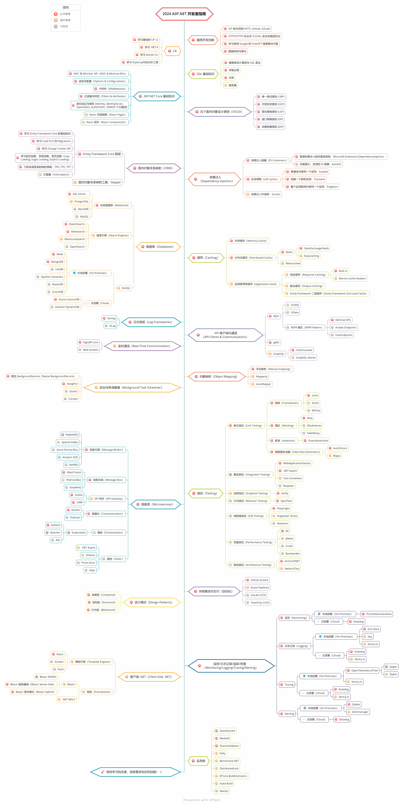

# ASP.NET Core开发者指南

- [英文 ReadMe](ReadMe.md)
- [简体中文 ReadMe](ReadMe.zh-Hans.md)
- [繁体中文 ReadMe](ReadMe.zh-Hant.md)

> 2021年 [ASP.NET Core](https://docs.microsoft.com/zh-cn/aspnet/core/) 开发者指南：

在下面，您可以看到一个图，说明可以采用的路径以及要成为ASP.NET Core开发人员所想要学习的库。我将此图作为提示，给所有问我"作为ASP.NET Core开发人员，接下来应该学习什么？"的人。

## 免责声明

> 该指南的目的是为了给读者心有个大概的轮廓。如果你对接下来要学习的内容感到困惑时，这张路线图将指导你，而不是鼓励你选择时髦的东西。你应该逐渐理解为什么一种工具比另一种工具更适合某些场景，并且记住时髦和新颖的东西并不总是意味着最适合这个工作。

## 请给一个星星! :star:

如果你喜欢或正在使用这个项目进行学习或引用在你的解决方案中，请给它一个星星。谢谢!

## 路线图

## 资源

1. 学习先决条件

   - [C#](https://www.pluralsight.com/paths/csharp)
   - [.NET 5](https://devblogs.microsoft.com/dotnet/introducing-net-5)
   - [Entity Framework](https://www.pluralsight.com/search?q=entity%20framework%20core)
   - [Dapper](https://github.com/StackExchange/Dapper)
   - [NHibernate](https://github.com/nhibernate/nhibernate-core)
   - [ASP.NET Core](https://www.pluralsight.com/search?q=asp.net%20core)
   - SQL 基础知识

2. 通用开发技能

   - 学习GIT 并且在 GitHub 中创建与分享项目
   - 掌握 HTTP(S) 协议与请求方法 (GET, POST, PUT, PATCH, DELETE, OPTIONS)
   - 不要害怕使用 Google，[Google搜索技巧](http://www.powersearchingwithgoogle.com)
   - 学习 [dotnet CLI](https://docs.microsoft.com/zh-cn/dotnet/core/tools/)
   - 阅读一些关于算法和数据结构的书籍

3. SOLID

    - [单一责任原则 (SRP)](https://www.dotnetcurry.com/software-gardening/1148/solid-single-responsibility-principle)
    - [开放封闭原则 (OCP)](https://www.dotnetcurry.com/software-gardening/1176/solid-open-closed-principle)
    - [里氏替换原则 (LSP)](https://www.dotnetcurry.com/software-gardening/1235/liskov-substitution-principle-lsp-solid-patterns)
    - [接口分离原则 (ISP)](https://www.dotnetcurry.com/software-gardening/1257/interface-segregation-principle-isp-solid-principle)
    - [依赖倒置原则 (DIP)](https://www.dotnetcurry.com/software-gardening/1284/dependency-injection-solid-principles)

4. 依赖注入

   1. DI 容器
      - [Microsoft.Extensions.DependencyInjection](https://docs.microsoft.com/zh-cn/aspnet/core/fundamentals/dependency-injection)
      - [AutoFac](https://autofaccn.readthedocs.io/en/latest/integration/aspnetcore.html)
      - [Ninject](http://www.ninject.org)
      - [Castle Windsor](https://github.com/castleproject/Windsor)
	  - [Simple Injector](https://github.com/simpleinjector/SimpleInjector)
   2. [生命周期](https://docs.microsoft.com/zh-cn/aspnet/core/fundamentals/dependency-injection#service-lifetimes)
   3. [Scrutor](https://github.com/khellang/Scrutor)

5. 数据库

   1. 关系型
      1. [SQL Server](https://www.microsoft.com/zh-cn/sql-server/sql-server-2019)
      2. [PostgreSQL](https://www.postgresql.org)
      3. [MariaDB](https://mariadb.org)
      4. [MySQL](https://www.mysql.com)
   2. 云数据库
      - [CosmosDB](https://docs.microsoft.com/zh-cn/azure/cosmos-db/)
      - [DynamoDB](https://aws.amazon.com/cn/dynamodb/)
   3. 搜索引擎
      - [ElasticSearch](https://www.elastic.co)
      - [Solr](http://lucene.apache.org/solr)
      - [Sphinx](http://sphinxsearch.com)
   4. NoSQL
      - [Redis](https://redis.io)
      - [MongoDB](https://docs.microsoft.com/zh-cn/aspnet/core/tutorials/first-mongo-app)
      - [Apache Cassandra](http://cassandra.apache.org)
      - [LiteDB](https://github.com/mbdavid/LiteDB)
      - [RavenDB](https://github.com/ravendb/ravendb)
      - [CouchDB](http://couchdb.apache.org)

6. 缓存

   1. [内存缓存](https://docs.microsoft.com/zh-cn/aspnet/core/performance/caching/memory)
   2. [分布式缓存](https://docs.microsoft.com/zh-cn/aspnet/core/performance/caching/distributed)
      1. [Redis](https://redis.io/)
         1. [StackExchange.Redis](https://stackexchange.github.io/StackExchange.Redis)
         2. [EasyCaching](https://github.com/dotnetcore/EasyCaching)
      2. [Memcached](https://memcached.org)
   3. Entity Framework 二级缓存
      1. [EFSecondLevelCache.Core](https://github.com/VahidN/EFSecondLevelCache.Core)
      2. [EntityFrameworkCore.Cacheable](https://github.com/SteffenMangold/EntityFrameworkCore.Cacheable)

7. 日志

   1. 日志框架
      - [Serilog](https://github.com/serilog/serilog)
      - [NLog](https://github.com/NLog/NLog)
   2. 日志管理系统
      - [ELK Stack](https://www.elastic.co/what-is/elk-stack)
      - [Sentry.io](http://sentry.io)
      - [Loggly.com](https://loggly.com)
      - [Elmah.io](http://elmah.io)
      
8. API客户端和通信

    1. REST
       - [OData](https://devblogs.microsoft.com/odata/experimenting-with-odata-in-asp-net-core-3-1)
       - [Sieve](https://github.com/Biarity/Sieve)
    2. [gRPC](https://docs.microsoft.com/zh-cn/aspnet/core/grpc)
    3. GraphQL
       - [HotChocolate](https://github.com/ChilliCream/hotchocolate)
       - [GraphQL-dotnet](https://github.com/graphql-dotnet/graphql-dotnet)

9. 实时通信

   - [SignalR](https://docs.microsoft.com/zh-cn/aspnet/core/signalr/introduction)
   - [WebSockets](https://docs.microsoft.com/zh-cn/aspnet/core/fundamentals/websockets)
   
10. 对象映射

   - [AutoMapper](https://github.com/AutoMapper/AutoMapper)
   - [Mapster](https://github.com/MapsterMapper/Mapster)
   - [ExpressMapper](http://expressmapper.org/)
   - [AgileMapper](https://github.com/agileobjects/AgileMapper)
   
11. 任务调度

    - [Coravel](https://github.com/jamesmh/coravel)
    - [HangFire](https://github.com/HangfireIO/Hangfire)
    - [Background Service](https://docs.microsoft.com/zh-cn/aspnet/core/fundamentals/host/hosted-services)
    - [Fluent Scheduler](https://github.com/fluentscheduler/FluentScheduler)
    
12. 测试

    1. 单元测试
       1. 框架
          - [xUnit](https://docs.microsoft.com/zh-cn/dotnet/core/testing/unit-testing-with-dotnet-test)
          - [NUnit](https://docs.microsoft.com/zh-cn/dotnet/core/testing/unit-testing-with-nunit)
          - [MSTest](https://docs.microsoft.com/zh-cn/dotnet/core/testing/unit-testing-with-mstest)
       2. 模拟
          - [Moq](https://github.com/moq/moq4)
          - [NSubstitute](https://github.com/nsubstitute/NSubstitute)
          - [FakeItEasy](https://github.com/FakeItEasy/FakeItEasy)
       3. 断言
          - [FluentAssertion](https://github.com/fluentassertions/fluentassertions)
          - [Shouldly](https://github.com/shouldly/shouldly)
    2. 集成测试
       - [WebApplicationFactory](https://docs.microsoft.com/zh-cn/aspnet/core/test/integration-tests)
       - [TestServer](https://koukia.ca/integration-testing-in-asp-net-core-2-0-51d14ede3968)
    3. 行为测试
       - [SpecFlow](https://github.com/techtalk/SpecFlow/tree/DotNetCore)
       - [BDDfy](https://github.com/TestStack/TestStack.BDDfy)
       - [LightBDD](https://github.com/LightBDD/LightBDD)
    4. 端到端测试
       - [Selenium](https://www.hanselman.com/blog/real-browser-integration-testing-with-selenium-standalone-chrome-and-aspnet-core-21)
       - [Puppeteer-Sharp](https://github.com/kblok/puppeteer-sharp)

13. 微服务

    1. 消息总线
       - [RabbitMQ](https://www.rabbitmq.com/tutorials/tutorial-one-dotnet.html)
       - [Apache Kafka](https://github.com/confluentinc/confluent-kafka-dotnet)
       - [ActiveMQ](https://github.com/apache/activemq)
       - [Azure Service Bus](https://docs.microsoft.com/zh-cn/azure/service-bus-messaging/service-bus-messaging-overview)
       - [NetMQ](https://github.com/zeromq/netmq)
    2. 消息队列
       - [MassTransit](https://github.com/MassTransit/MassTransit)
       - [NServiceBus](https://github.com/Particular/NServiceBus)
       - [EasyNetQ](https://github.com/EasyNetQ/EasyNetQ)
       - [CAP](https://github.com/dotnetcore/CAP)
    3. API 网关
       - [Ocelot](https://github.com/ThreeMammals/Ocelot)
    4. 容器化
       - [Docker](https://www.docker.com)
    5. 服务编排
       - [Kubernetes](https://kubernetes.io)
       - [Docker Swarm](https://docs.docker.com/engine/swarm)
    6. 反向代理
       - [YARP](https://github.com/microsoft/reverse-proxy)
    7. 其他
       - [Orleans](https://github.com/dotnet/orleans)
       - [Steeltoe](https://steeltoe.io)
       - [Dapr](https://github.com/dapr/dapr)
       - [Tye](https://github.com/dotnet/tye)

14. 持续集成与部署
    - [Gihub Actions](https://github.com/features/actions)
    - [Azure Pipelines](https://azure.microsoft.com/zh-cn/services/devops/pipelines/)
    - [Travis CI](https://travis-ci.org)
    - [Jenkins](https://www.jenkins.io)
    - [Circle CI](https://circleci.com)
    - [TeamCity](https://www.jetbrains.com/teamcity)

15. 设计模式

    - [CQRS](https://docs.microsoft.com/zh-cn/azure/architecture/patterns/cqrs)
    - [Decorator](https://www.dofactory.com/net/decorator-design-pattern)
    - [Strategy](https://www.dofactory.com/net/strategy-design-pattern)
    - [Builder](https://www.dofactory.com/net/builder-design-pattern)
    - [Singleton](https://www.dofactory.com/net/singleton-design-pattern)
    - [Facade](https://www.dofactory.com/net/facade-design-pattern)

16. 客户端库
    - [Blazor](https://docs.microsoft.com/zh-cn/aspnet/core/blazor/)

17. 模板引擎

   - [Razor](https://docs.microsoft.com/zh-cn/aspnet/core/mvc/views/razor)
   - [DotLiquid](https://github.com/dotliquid/dotliquid)
   - [Scriban](https://github.com/lunet-io/scriban)
   - [Fluid](https://github.com/sebastienros/fluid)

18. 进一步了解的类库

    - [MediatR](https://github.com/jbogard/MediatR)
    - [Fluent Validation](https://github.com/JeremySkinner/FluentValidation)
    - [Polly](https://github.com/App-vNext/Polly)    
    - [Benchmark.NET](https://github.com/dotnet/BenchmarkDotNet)
    - [NodaTime](https://github.com/nodatime/nodatime)
    - [GenFu](https://github.com/MisterJames/GenFu)
    - [Swashbuckle](https://github.com/domaindrivendev/Swashbuckle.AspNetCore)

## 总结

如果你认为该指南可以改进，请提交包含任何更新的 PR 并提交任何问题。此外，我将继续改进这个仓库，因此你可以 star 这个仓库以便于重新访问。

灵感来源： [React Developer RoadMap](https://github.com/adam-golab/react-developer-roadmap)

## 贡献

该指南是使用 [xMind](https://www.xmind.net/) 构建的。中文版项目文件为`aspnetcore-developer-roadmap.zh-Hans.xmind`。要修改它, 在[此处](https://www.xmind.net/download/)下载 xMind, 点击 **Open File** 并选择项目中的 `xmind` 文件。它将为你渲染生成路线图，更新它，上传和更新 readme 中的图像并创建一个 PR（使用[Compressor.io](https://compressor.io/compress)压缩导出的PNG；不过中国无法访问，用PS吧）。

- 改进后提交 PR
- 在 Issues 中讨论问题
- 推广项目

## 许可协议

