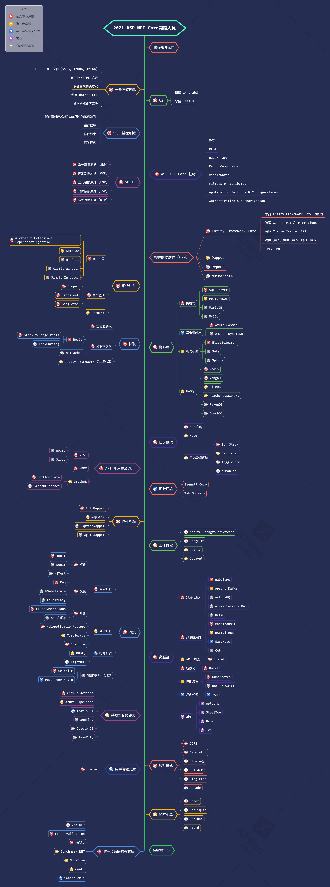

# ASP.NET Core 開發人員指南

- [英文 ReadMe](ReadMe.md)
- [繁體中文 ReadMe](ReadMe.zh-Hant.md)
- [简体中文 ReadMe](ReadMe.zh-Hans.md)

> 2021年 [ASP.NET Core](https://docs.microsoft.com/zh-tw/aspnet/core/) 開發人員指南：

在下面，您可以看到一張圖片，說明可以採取的學習路徑以及要成為 ASP.NET Core 開發人員所要學習的程式庫。我將此圖片作為提示，給所有問我"作為 ASP.NET Core 開發人員，接下來應該學習什麼？"的人。

## 免責聲明

> 本指南的目的是為了給讀者心裡有個大概的輪廓。如果您對接下來要學習的內容感到困惑時，這張路線圖將指導您，而不是鼓勵您選擇時髦和前衛的東西。您應該逐漸理解為什麼一種工具比另一種工具更適合某些場景，並且記住時髦和前衛的東西並不總是意味著最適合這個工作。

## 請給一個星星! :star:

如果您喜歡或正在使用這個專案進行學習或開始在您的解決方案中，請給它一個星星。謝謝!

## 學習指南

## 資源

1. 瞭解先決條件

   - [C#](https://www.pluralsight.com/paths/csharp)
   - [.NET 5](https://devblogs.microsoft.com/dotnet/introducing-net-5)
   - [Entity Framework](https://www.pluralsight.com/search?q=entity%20framework%20core)
   - [Dapper](https://github.com/StackExchange/Dapper)
   - [NHibernate](https://github.com/nhibernate/nhibernate-core)
   - [ASP.NET Core](https://www.pluralsight.com/search?q=asp.net%20core)
   - SQL 基礎知識

2. 一般開發技能

   - 學習 GIT 並且在 GitHub 中建立與分享您的專案
   - 掌握 HTTP(S) 協定與請求方法(GET, POST, PUT, PATCH, DELETE, OPTIONS)
   - 不要害怕使用 Google [Google搜尋技巧](http://www.powersearchingwithgoogle.com)
   - 學習 [dotnet CLI](https://docs.microsoft.com/zh-tw/dotnet/core/tools/)
   - 閱讀一些關於演算法和資料結構的書籍

3. SOLID

    - [單一職責原則(SRP)](https://www.dotnetcurry.com/software-gardening/1148/solid-single-responsibility-principle)
    - [開放封閉原則(OCP)](https://www.dotnetcurry.com/software-gardening/1176/solid-open-closed-principle)
    - [里氏替換原則(LSP)](https://www.dotnetcurry.com/software-gardening/1235/liskov-substitution-principle-lsp-solid-patterns)
    - [介面隔離原則(ISP)](https://www.dotnetcurry.com/software-gardening/1257/interface-segregation-principle-isp-solid-principle)
    - [依賴反轉原則(DIP)](https://www.dotnetcurry.com/software-gardening/1284/dependency-injection-solid-principles)

4. 相依注入

   1. DI 容器
      - [Microsoft.Extensions.DependencyInjection](https://docs.microsoft.com/zh-tw/aspnet/core/fundamentals/dependency-injection)
      - [AutoFac](https://autofaccn.readthedocs.io/en/latest/integration/aspnetcore.html)
      - [Ninject](http://www.ninject.org)
      - [Castle Windsor](https://github.com/castleproject/Windsor)
	  - [Simple Injector](https://github.com/simpleinjector/SimpleInjector)
   2. [生命週期](https://docs.microsoft.com/zh-tw/aspnet/core/fundamentals/dependency-injection#service-lifetimes)
   3. [Scrutor](https://github.com/khellang/Scrutor)

5. 資料庫

   1. 關聯式
      1. [SQL Server](https://www.microsoft.com/zh-tw/sql-server/sql-server-2019)
      2. [PostgreSQL](https://www.postgresql.org)
      3. [MariaDB](https://mariadb.org)
      4. [MySQL](https://www.mysql.com)
   2. 雲端資料庫
      - [CosmosDB](https://docs.microsoft.com/zh-tw/azure/cosmos-db/)
      - [DynamoDB](https://aws.amazon.com/tw/dynamodb/)
   3. 搜尋引擎
      - [ElasticSearch](https://www.elastic.co)
      - [Solr](http://lucene.apache.org/solr)
      - [Sphinx](http://sphinxsearch.com)
   4. NoSQL
      - [Redis](https://redis.io)
      - [MongoDB](https://docs.microsoft.com/zh-tw/aspnet/core/tutorials/first-mongo-app)
      - [Apache Cassandra](http://cassandra.apache.org)
      - [LiteDB](https://github.com/mbdavid/LiteDB)
      - [RavenDB](https://github.com/ravendb/ravendb)
      - [CouchDB](http://couchdb.apache.org)

6. 快取

   1. [記憶體快取](https://docs.microsoft.com/zh-tw/aspnet/core/performance/caching/memory)
   2. [分散式快取](https://docs.microsoft.com/zh-tw/aspnet/core/performance/caching/distributed)
      1. [Redis](https://redis.io/)
         1. [StackExchange.Redis](https://stackexchange.github.io/StackExchange.Redis)
         2. [EasyCaching](https://github.com/dotnetcore/EasyCaching)
      2. [Memcached](https://memcached.org)
   3. Entity Framework 第二層快取
      1. [EFSecondLevelCache.Core](https://github.com/VahidN/EFSecondLevelCache.Core)
      2. [EntityFrameworkCore.Cacheable](https://github.com/SteffenMangold/EntityFrameworkCore.Cacheable)

7. 日誌

   1. 日誌框架
      - [Serilog](https://github.com/serilog/serilog)
      - [NLog](https://github.com/NLog/NLog)
   2. 日誌管理系統
      - [ELK Stack](https://www.elastic.co/what-is/elk-stack)
      - [Sentry.io](http://sentry.io)
      - [Loggly.com](https://loggly.com)
      - [Elmah.io](http://elmah.io)
      
8. API 用戶端及通訊

    1. REST
       - [OData](https://devblogs.microsoft.com/odata/experimenting-with-odata-in-asp-net-core-3-1)
       - [Sieve](https://github.com/Biarity/Sieve)
    2. [gRPC](https://docs.microsoft.com/zh-tw/aspnet/core/grpc)
    3. GraphQL
       - [HotChocolate](https://github.com/ChilliCream/hotchocolate)
       - [GraphQL-dotnet](https://github.com/graphql-dotnet/graphql-dotnet)

9. 即時通訊

   - [SignalR](https://docs.microsoft.com/zh-tw/aspnet/core/signalr/introduction)
   - [WebSockets](https://docs.microsoft.com/zh-tw/aspnet/core/fundamentals/websockets)
   
10. 物件對應

   - [AutoMapper](https://github.com/AutoMapper/AutoMapper)
   - [Mapster](https://github.com/MapsterMapper/Mapster)
   - [ExpressMapper](http://expressmapper.org/)
   - [AgileMapper](https://github.com/agileobjects/AgileMapper)
   
11. 工作排程

    - [Coravel](https://github.com/jamesmh/coravel)
    - [HangFire](https://github.com/HangfireIO/Hangfire)
    - [Background Service](https://docs.microsoft.com/zh-tw/aspnet/core/fundamentals/host/hosted-services)
    - [Fluent Scheduler](https://github.com/fluentscheduler/FluentScheduler)
    
12. 測試

    1. 單元測試
       1. 框架
          - [xUnit](https://docs.microsoft.com/zh-tw/dotnet/core/testing/unit-testing-with-dotnet-test)
          - [NUnit](https://docs.microsoft.com/zh-tw/dotnet/core/testing/unit-testing-with-nunit)
          - [MSTest](https://docs.microsoft.com/zh-tw/dotnet/core/testing/unit-testing-with-mstest)
       2. 模擬
          - [Moq](https://github.com/moq/moq4)
          - [NSubstitute](https://github.com/nsubstitute/NSubstitute)
          - [FakeItEasy](https://github.com/FakeItEasy/FakeItEasy)
       3. 判斷
          - [FluentAssertion](https://github.com/fluentassertions/fluentassertions)
          - [Shouldly](https://github.com/shouldly/shouldly)
    2. 整合測試
       - [WebApplicationFactory](https://docs.microsoft.com/zh-tw/aspnet/core/test/integration-tests)
       - [TestServer](https://koukia.ca/integration-testing-in-asp-net-core-2-0-51d14ede3968)
    3. 行為測試
       - [SpecFlow](https://github.com/techtalk/SpecFlow/tree/DotNetCore)
       - [BDDfy](https://github.com/TestStack/TestStack.BDDfy)
       - [LightBDD](https://github.com/LightBDD/LightBDD)
    4. 端對端(E2E)測試
       - [Selenium](https://www.hanselman.com/blog/real-browser-integration-testing-with-selenium-standalone-chrome-and-aspnet-core-21)
       - [Puppeteer-Sharp](https://github.com/kblok/puppeteer-sharp)

13. 微服務

    1. 訊息代理人
       - [RabbitMQ](https://www.rabbitmq.com/tutorials/tutorial-one-dotnet.html)
       - [Apache Kafka](https://github.com/confluentinc/confluent-kafka-dotnet)
       - [ActiveMQ](https://github.com/apache/activemq)
       - [Azure Service Bus](https://docs.microsoft.com/zh-tw/azure/service-bus-messaging/service-bus-messaging-overview)
       - [NetMQ](https://github.com/zeromq/netmq)
    2. 訊息匯流排
       - [MassTransit](https://github.com/MassTransit/MassTransit)
       - [NServiceBus](https://github.com/Particular/NServiceBus)
       - [EasyNetQ](https://github.com/EasyNetQ/EasyNetQ)
       - [CAP](https://github.com/dotnetcore/CAP)
    3. API 閘道
       - [Ocelot](https://github.com/ThreeMammals/Ocelot)
    4. 容器化
       - [Docker](https://www.docker.com)
    5. 協調流程
       - [Kubernetes](https://kubernetes.io)
       - [Docker Swarm](https://docs.docker.com/engine/swarm)
    6. 反向 Proxy
       - [YARP](https://github.com/microsoft/reverse-proxy)
    7. 其他
       - [Orleans](https://github.com/dotnet/orleans)
       - [Steeltoe](https://steeltoe.io)
       - [Dapr](https://github.com/dapr/dapr)
       - [Tye](https://github.com/dotnet/tye)

14. 持續整合與部署
    - [Gihub Actions](https://github.com/features/actions)
    - [Azure Pipelines](https://azure.microsoft.com/zh-tw/services/devops/pipelines/)
    - [Travis CI](https://travis-ci.org)
    - [Jenkins](https://www.jenkins.io)
    - [Circle CI](https://circleci.com)
    - [TeamCity](https://www.jetbrains.com/teamcity)

15. 設計模式

    - [CQRS](https://docs.microsoft.com/zh-tw/azure/architecture/patterns/cqrs)
    - [Decorator](https://www.dofactory.com/net/decorator-design-pattern)
    - [Strategy](https://www.dofactory.com/net/strategy-design-pattern)
    - [Builder](https://www.dofactory.com/net/builder-design-pattern)
    - [Singleton](https://www.dofactory.com/net/singleton-design-pattern)
    - [Facade](https://www.dofactory.com/net/facade-design-pattern)

16. 用戶端程式庫
    - [Blazor](https://docs.microsoft.com/zh-tw/aspnet/core/blazor/)

17. 範本引擎

   - [Razor](https://docs.microsoft.com/zh-tw/aspnet/core/mvc/views/razor)
   - [DotLiquid](https://github.com/dotliquid/dotliquid)
   - [Scriban](https://github.com/lunet-io/scriban)
   - [Fluid](https://github.com/sebastienros/fluid)

18. 進一步瞭解的程式庫

    - [MediatR](https://github.com/jbogard/MediatR)
    - [Fluent Validation](https://github.com/JeremySkinner/FluentValidation)
    - [Polly](https://github.com/App-vNext/Polly)    
    - [Benchmark.NET](https://github.com/dotnet/BenchmarkDotNet)
    - [NodaTime](https://github.com/nodatime/nodatime)
    - [GenFu](https://github.com/MisterJames/GenFu)
    - [Swashbuckle](https://github.com/domaindrivendev/Swashbuckle.AspNetCore)

## 總結

如果您認為本指南可以改進，請提交包含任何更新的 PR 或提交任何問題。此外，我將繼續改進這個存放庫，因此您可以按下 star 這個存放庫以便於重新訪問。

靈感來源： [React Developer RoadMap](https://github.com/adam-golab/react-developer-roadmap)

## 貢獻

想做點貢獻嗎？我們鼓勵社群回饋與貢獻。

本指南是使用 [xMind](https://www.xmind.net/) 來建構。繁體中文版專案檔案為`aspnetcore-developer-roadmap.zh-Hant.xmind`。要修改它, 在[此處](https://www.xmind.net/download/)下載 xMind, 點選 **Open File** 並選擇 `xmind` 檔案，它將為您開啟此指南，更新它後，上傳和更新 ReadMe 中的圖片並建立一個 PR（使用[Compressor.io](https://compressor.io/compress)壓縮匯出的PNG）。

- 修改後提交 PR
- 在 Issues 中討論問題
- 推廣此專案

## 許可協議

 本著作係採用<a rel="license" href="http://creativecommons.org/licenses/by-nc-sa/4.0/">創用 CC 姓名標示-非商業性-相同方式分享 4.0 國際 授權條款</a>授權.