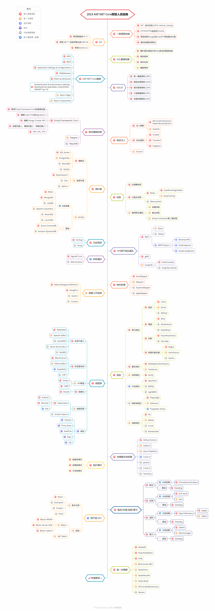

# ASP.NET Core開發人員指南

- [英文 ReadMe](ReadMe.md)
- [繁體中文 ReadMe](ReadMe.zh-Hant.md)
- [简体中文 ReadMe](ReadMe.zh-Hans.md)
- [土耳其文 ReadMe](ReadMe-tr.md)
- [日文 ReadMe](ReadMe.ja.md)

> 2023年 [ASP.NET Core](https://docs.microsoft.com/zh-tw/aspnet/core/) 開發人員指南：

以下您會看到一張圖表，說明可以採取的學習路徑以及要成為ASP.NET Core開發人員所要學習的程式庫。我將此圖表作為提示，給每個問我「作為ASP.NET Core 開發人員，接下來應該學習什麼？」的人。

## 免責聲明

> 這份指南的目的是為了給讀者心裡有個大概的輪廓。如果您對接下來要學習的內容感到困惑時，這張路線指南將引導您，而不是鼓勵您選擇時髦和前衛的東西。您應該逐漸理解為什麼一種工具比另一種工具更適合某些場景，並且記住時髦和前衛的東西並不總是意味著最適合完成工作。

## 請給一個星星! :star:

如果您喜歡或正在使用這個專案進行學習或開始您的解決方案，請給它一個星星。謝謝!

## 學習指南

## 學習資源

1. 一般開發技能
   - 學習[Git](https://git-scm.com/doc)並且在[GitHub](https://docs.github.com/en/get-started/quickstart)中建立與分享您的專案
   - 掌握[HTTP(S)協定](https://developer.mozilla.org/en-US/docs/Web/HTTP/Overview)與請求方法([GET](https://developer.mozilla.org/en-US/docs/Web/HTTP/Methods/GET)， [POST](https://developer.mozilla.org/en-US/docs/Web/HTTP/Methods/POST)， [PUT](https://developer.mozilla.org/en-US/docs/Web/HTTP/Methods/PUT)， [PATCH](https://developer.mozilla.org/en-US/docs/Web/HTTP/Methods/PATCH)， [DELETE](https://developer.mozilla.org/en-US/docs/Web/HTTP/Methods/DELETE)， [OPTIONS](https://developer.mozilla.org/en-US/docs/Web/HTTP/Methods/OPTIONS)等)
   - 什麼是[TLS](https://www.cloudflare.com/zh-tw/learning/ssl/transport-layer-security-tls/)？
   - 什麼是[SSL](https://www.cloudflare.com/zh-tw/learning/ssl/what-is-ssl/)？
   - 不要害怕使用[Google搜尋技巧](http://www.powersearchingwithgoogle.com)
   - 開始使用[ChatGPT](https://chat.openai.com/chat)
   - [閱讀一些關於演算法和資料結構的書籍](https://www.tenlong.com.tw/categories/algorithms-data-structures)

2. C#
   - [C#](https://www.pluralsight.com/paths/c-10)
   - [.NET 7](https://devblogs.microsoft.com/dotnet/announcing-dotnet-7)
   - 學習[dotnet CLI](https://learn.microsoft.com/zh-tw/dotnet/core/tools/)

3. SQL基礎知識
   - [Pluralsight學習路徑：從SQL Server使用T-SQL查詢資料](https://www.pluralsight.com/paths/querying-data-with-t-sql-from-sql-server)

4. ASP.NET Core基礎
   - [MVC](https://docs.microsoft.com/zh-tw/aspnet/core/mvc/overview)
   - [REST](https://docs.microsoft.com/zh-tw/aspnet/core/tutorials/first-web-api)
   - [Application Settings & Configurations](https://docs.microsoft.com/zh-tw/aspnet/core/fundamentals/configuration)
   - [Middlewares](https://docs.microsoft.com/zh-tw/aspnet/core/fundamentals/middleware/)
   - [Filters & Attributes](https://docs.microsoft.com/zh-tw/aspnet/core/mvc/controllers/filters)
   - [Authentication](https://docs.microsoft.com/zh-tw/aspnet/core/security/authentication/)
   - [Authorization](https://docs.microsoft.com/zh-tw/aspnet/core/security/authorization/introduction)
   - [IdentityServer](https://identityserver4.readthedocs.io/en/latest)
   - [OpenIddict](https://github.com/openiddict/openiddict-core)
   - [Auth0](https://auth0.com/docs)
   - [OIDC](https://openid.net/connect)
   - [Razor Pages](https://docs.microsoft.com/zh-tw/aspnet/core/razor-pages/)
   - [Razor Components](https://docs.microsoft.com/zh-tw/aspnet/core/blazor/components/)
   - 教學課程
      - [Pluralsight學習路徑：ASP.NET Core 6](https://www.pluralsight.com/paths/aspnet-core-6)
      - [Pluralsight學習路徑：ASP.NET Core 6 Web API](https://www.pluralsight.com/paths/aspnet-core-6-web-api)

5. SOLID
    - [單一職責原則(SRP)](https://www.dotnetcurry.com/software-gardening/1148/solid-single-responsibility-principle)
    - [開放封閉原則(OCP)](https://www.dotnetcurry.com/software-gardening/1176/solid-open-closed-principle)
    - [里氏替換原則(LSP)](https://www.dotnetcurry.com/software-gardening/1235/liskov-substitution-principle-lsp-solid-patterns)
    - [介面隔離原則(ISP)](https://www.dotnetcurry.com/software-gardening/1257/interface-segregation-principle-isp-solid-principle)
    - [依賴反轉原則(DIP)](https://www.dotnetcurry.com/software-gardening/1284/dependency-injection-solid-principles)

6. 物件關聯對應
    - [Entity Framework Core](https://learn.microsoft.com/zh-tw/ef/core/)
       - 教學課程
          - [Pluralsight學習路徑：EF Core 6](https://www.pluralsight.com/paths/ef-core-6)
    - [Dapper](https://github.com/StackExchange/Dapper)
    - [RepoDB](https://github.com/mikependon/RepoDB)

7. 相依注入
   1. 注入容器
      - [Microsoft.Extensions.DependencyInjection](https://docs.microsoft.com/zh-tw/aspnet/core/fundamentals/dependency-injection)
      - [AutoFac](https://autofaccn.readthedocs.io/en/latest/integration/aspnetcore.html)
      - [Ninject](http://www.ninject.org)
      - [Castle Windsor](https://github.com/castleproject/Windsor)
	  - [Simple Injector](https://github.com/simpleinjector/SimpleInjector)
   2. [生命週期](https://docs.microsoft.com/zh-tw/aspnet/core/fundamentals/dependency-injection#service-lifetimes)
   3. [Scrutor](https://github.com/khellang/Scrutor)

8. 資料庫
   1. 關聯式
      - [SQL Server](https://www.microsoft.com/zh-tw/sql-server/sql-server-2022)
      - [PostgreSQL](https://www.postgresql.org)
      - [MariaDB](https://mariadb.org)
      - [MySQL](https://www.mysql.com)
   3. 搜尋引擎
      - [ElasticSearch](https://www.elastic.co)
      - [Solr](http://lucene.apache.org/solr)
      - [Sphinx](http://sphinxsearch.com)
   4. NoSQL
        - 落地
          - [Redis](https://redis.io)
          - [MongoDB](https://docs.microsoft.com/zh-tw/aspnet/core/tutorials/first-mongo-app)
          - [Apache Cassandra](http://cassandra.apache.org)
          - [LiteDB](https://github.com/mbdavid/LiteDB)
          - [RavenDB](https://github.com/ravendb/ravendb)
          - [CouchDB](http://couchdb.apache.org)
        - 雲端
          - [CosmosDB](https://docs.microsoft.com/azure/cosmos-db)
          - [DynamoDB](https://aws.amazon.com/dynamodb)   

9. 快取
    - [記憶體快取](https://docs.microsoft.com/zh-tw/aspnet/core/performance/caching/memory)
    - [分散式快取](https://docs.microsoft.com/zh-tw/aspnet/core/performance/caching/distributed)
       1. [Redis](https://redis.io/)
          1. [StackExchange.Redis](https://stackexchange.github.io/StackExchange.Redis)
          2. [EasyCaching](https://github.com/dotnetcore/EasyCaching)
       2. [Memcached](https://memcached.org)
    - 應用程式層級
       - [回應快取](https://learn.microsoft.com/zh-tw/aspnet/core/performance/caching/response)
       - [輸出快取](https://learn.microsoft.com/zh-tw/aspnet/core/performance/caching/output?source=recommendations)
       - [Entity Framework第二層快取](https://github.com/VahidN/EFCoreSecondLevelCacheInterceptor)

10. 日誌框架
    - [Serilog](https://github.com/serilog/serilog)
    - [NLog](https://github.com/NLog/NLog)

11. API用戶端及通訊
    1. REST
       - [Sieve](https://github.com/Biarity/Sieve)
       - [OData](https://learn.microsoft.com/zh-tw/odata/webapi/first-odata-api) 
       - [REPR Pattern](https://ardalis.com/mvc-controllers-are-dinosaurs-embrace-api-endpoints/)
            - [Minimal APIs](https://learn.microsoft.com/zh-tw/aspnet/core/fundamentals/minimal-apis/overview)
            - [Fast Endpoints](https://github.com/FastEndpoints/FastEndpoints)
            - [Ardalis.Endpoints](https://github.com/ardalis/ApiEndpoints)
    2. [gRPC](https://docs.microsoft.com/zh-tw/aspnet/core/grpc)
    3. GraphQL
        - [HotChocolate](https://github.com/ChilliCream/hotchocolate)
        - [GraphQL-dotnet](https://github.com/graphql-dotnet/graphql-dotnet)

12. 即時通訊
   - [SignalR](https://docs.microsoft.com/zh-tw/aspnet/core/signalr/introduction)
   - [WebSockets](https://docs.microsoft.com/zh-tw/aspnet/core/fundamentals/websockets)

13. 物件對應
   - [AutoMapper](https://github.com/AutoMapper/AutoMapper)
   - [Mapster](https://github.com/MapsterMapper/Mapster)
   - [ExpressMapper](http://expressmapper.org/)
   - [AgileMapper](https://github.com/agileobjects/AgileMapper)

14. 背景工作排程
    - [Native BackgroundService](https://docs.microsoft.com/zh-tw/aspnet/core/fundamentals/host/hosted-services)
    - [HangFire](https://github.com/HangfireIO/Hangfire)
    - [Quartz](https://github.com/quartznet/quartznet)
    - [Coravel](https://github.com/jamesmh/coravel) 

15. 測試
    1. 單元測試
       - 框架
          - [xUnit](https://learn.microsoft.com/zh-tw/dotnet/core/testing/unit-testing-with-dotnet-test)
          - [NUnit](https://learn.microsoft.com/zh-tw/dotnet/core/testing/unit-testing-with-nunit)
          - [MSTest](https://learn.microsoft.com/zh-tw/dotnet/core/testing/unit-testing-with-mstest)
       - 模擬
          - [Moq](https://github.com/moq/moq4)
          - [NSubstitute](https://github.com/nsubstitute/NSubstitute)
          - [FakeItEasy](https://github.com/FakeItEasy/FakeItEasy)
       - 判斷
          - [FluentAssertion](https://github.com/fluentassertions/fluentassertions)
          - [Shouldly](https://github.com/shouldly/shouldly)
       - 假資料產生器
          - [Bogus](https://github.com/bchavez/Bogus)
          - [AutoFixture](https://github.com/AutoFixture/AutoFixture)
          - [GenFu](https://github.com/MisterJames/GenFu)
    2. 整合測試
       - [WebApplicationFactory](https://learn.microsoft.com/zh-tw/aspnet/core/test/integration-tests)
       - [TestServer](https://koukia.ca/integration-testing-in-asp-net-core-2-0-51d14ede3968)
    3. 快照測試
       - [Verify](https://github.com/VerifyTests/Verify)
    4. 行為測試
       - [SpecFlow](https://github.com/techtalk/SpecFlow/tree/DotNetCore)
       - [BDDfy](https://github.com/TestStack/TestStack.BDDfy)
       - [LightBDD](https://github.com/LightBDD/LightBDD)
    5. 端對端測試
       - [Selenium](https://www.hanselman.com/blog/real-browser-integration-testing-with-selenium-standalone-chrome-and-aspnet-core-21)
       - [Puppeteer-Sharp](https://github.com/kblok/puppeteer-sharp)
    6. 效能測試
       - [K6](https://github.com/grafana/k6)
       - [JMeter](https://github.com/apache/jmeter)
       - [Crank](https://github.com/dotnet/crank)
       - [Bombardier](https://github.com/codesenberg/bombardier)

16. 微服務
    1. 訊息代理人
       - [RabbitMQ](https://www.rabbitmq.com/tutorials/tutorial-one-dotnet.html)
       - [Apache Kafka](https://github.com/confluentinc/confluent-kafka-dotnet)
       - [ActiveMQ](https://github.com/apache/activemq)
       - [Azure Service Bus](https://learn.microsoft.com/zh-tw/azure/service-bus-messaging/service-bus-messaging-overview)
       - [NetMQ](https://github.com/zeromq/netmq)
    2. 訊息匯流排
       - [MassTransit](https://github.com/MassTransit/MassTransit)
       - [NServiceBus](https://github.com/Particular/NServiceBus)
       - [EasyNetQ](https://github.com/EasyNetQ/EasyNetQ)
       - [CAP](https://github.com/dotnetcore/CAP)
    3. API閘道
       - [Ocelot](https://github.com/ThreeMammals/Ocelot)
       - [YARP](https://github.com/microsoft/reverse-proxy)
    4. 容器化
       - [Docker](https://www.docker.com)
    5. 協調流程
       - [Kubernetes](https://kubernetes.io)
         - [Rancher](https://github.com/rancher/rancher)
         - [Kubectl](https://kubernetes.io/docs/reference/kubectl)
         - [K9s](https://github.com/derailed/k9s)
       - [Docker Swarm](https://docs.docker.com/engine/swarm)
    6. 其他
       - [Orleans](https://github.com/dotnet/orleans)
       - [Proto.Actor](https://github.com/asynkron/protoactor-dotnet)
       - [Steeltoe](https://steeltoe.io)
       - [Dapr](https://github.com/dapr/dapr)
       - [Tye](https://github.com/dotnet/tye)
       
17. 持續整合與部署
    - [GitHub Actions](https://github.com/features/actions)
    - [Gitlab CI](https://docs.gitlab.com/ee/ci)
    - [Azure Pipelines](https://azure.microsoft.com/zh-tw/products/devops/pipelines/)
    - [Travis CI](https://travis-ci.org)
    - [Jenkins](https://www.jenkins.io)
    - [Circle CI](https://circleci.com)
    - [TeamCity](https://www.jetbrains.com/teamcity)

18. 設計模式
    - 分類
      - [創建型模式](https://learn.microsoft.com/zh-tw/azure/architecture/patterns/cqrs)
      - [結構型模式](https://www.dofactory.com/net/decorator-design-pattern)
      - [行為型模式](https://www.dofactory.com/net/strategy-design-pattern)
    - 教學課程
      - [Pluralsight學習路徑：C#的設計模式](https://www.pluralsight.com/paths/design-patterns-in-c)
 
19. 監控/記錄/追蹤/警示
    - 監控
       - 落地
          - [Prometheus](https://github.com/prometheus/prometheus)
          - [Grafana](https://github.com/grafana/grafana)
       - 雲端
          - [Datadog](https://www.datadoghq.com)
    - 記錄
       - 落地
          - [ELK Stack](https://www.elastic.co/what-is/elk-stack)
          - [Seq](https://datalust.co/seq)
       - 雲端
          - [Datadog](https://docs.datadoghq.com/logs)
    - 追蹤
       - 落地
          - [OpenTelemetry](https://github.com/open-telemetry/opentelemetry-dotnet)
             - [Jaeger](https://github.com/jaegertracing/jaeger)
             - [Zipkin](https://github.com/openzipkin/zipkin)
       - 雲端
          - [Datadog](https://docs.datadoghq.com/tracing)
    - 警示
       - 落地
          - [Zabbix](https://www.zabbix.com)
          - [Alertmanager](https://github.com/prometheus/alertmanager)
       - 雲端
          - [Datadog](https://docs.datadoghq.com/monitors)

20. 用戶端.NET
    - 範本引擎
       - [Razor](https://docs.microsoft.com/aspnet/core/mvc/views/razor)
       - [DotLiquid](https://github.com/dotliquid/dotliquid)
       - [Scriban](https://github.com/lunet-io/scriban)
       - [Fluid](https://github.com/sebastienros/fluid)
    - 框架
       - [Blazor](https://dotnet.microsoft.com/apps/aspnet/web-apps/blazor)
       - [.NET MAUI](https://github.com/dotnet/maui)

21. 進一步學習
    - [MediatR](https://github.com/jbogard/MediatR)
    - [Fluent Validation](https://github.com/JeremySkinner/FluentValidation)
    - [Polly](https://github.com/App-vNext/Polly)
    - [Benchmark.NET](https://github.com/dotnet/BenchmarkDotNet)
    - [NodaTime](https://github.com/nodatime/nodatime)
    - [Swashbuckle](https://github.com/domaindrivendev/Swashbuckle.AspNetCore)
    - [Nuke](https://github.com/nuke-build/nuke)
    - [EF Core Bulk Extensions](https://github.com/borisdj/EFCore.BulkExtensions)

## 總結

如果您認為本指南可以改進，請提交包含任何更新的PR或提交任何Issue。此外，我將會持續改進這個存放庫，因此您可以按下 star 這個存放庫以便於重新訪問。

靈感來源： [React Developer RoadMap](https://github.com/adam-golab/react-developer-roadmap)

## 貢獻

想做點貢獻嗎？我們鼓勵社群回饋與貢獻。

本指南是使用 [xMind](https://www.xmind.net/) 來建構。繁體中文版專案檔案為`aspnetcore-developer-roadmap.zh-Hant.xmind`。要修改它，在[此處](https://www.xmind.net/download/)下載 xMind，點選 **Open File** 並選擇 `xmind` 檔案，它將為您開啟此指南，更新它之後，上傳和更新`ReadMe.zh-Hant.md`中的圖片並建立一個PR。

- 修改後提交PR
- 在Issues中討論問題
- 推廣此專案

## 許可協議

 本著作係採用<a rel="license" href="http://creativecommons.org/licenses/by-nc-sa/4.0/">創用 CC 姓名標示-非商業性-相同方式分享 4.0 國際 授權條款</a>授權.
